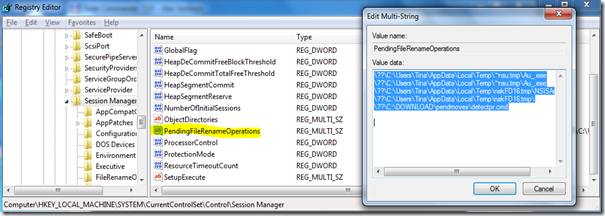

When installing Applications or operating system hotfixes the installation process sometimes requires replacing or deleting files that are in use, if that is the case these files can only be replaced or deleted during the next system reboot. 

  When you plan to install multiple applications in a row you can run into the situation where an application cannot be installed due to a pending FileRename operation from a previous application installation. So if you plan to install several applications in a row without a reboot, it’s highly recommended to check if a given application does actually require a reboot or not. If you launch the installation process manually you will most likely get a “Reboot required” prompt at the end of the installation. But if you run your installation packages in silent mode with the REBOOT=ReallySuppress option you will not notice if a reboot is required or not. 

  The information for Pending FileRename Operations is stored within the Windows Registry under:

  HKEY_LOCAL_MACHINE\SYSTEM\CurrentControlSet\Control\Session Manager\ under the key PendingFileRenameOperations if this key does not exist there are no Pending FileRename Operations, if the key does exist the key value data contains the files that need to be replaced or deleted. 

   

  Mark Russinovich provides two useful utilities that deal with Pending FileRename Operations PendMoves.exe and MoveFile.exe. PendMoves.exe allows you to list any pending filemoves and FileMove.exe allows you to configure the system to replace or delete a file during the next system reboot. The tools can be downloaded from [here](http://technet.microsoft.com/en-us/sysinternals/bb897556.aspx) and for more information you might also want to read [this article](http://207.46.16.252/en-us/magazine/2009.06.utilityspotlight.aspx). For those that are looking for a script based solution have a look at the [WMI script](http://blogs.msdn.com/tommills/archive/2008/08/15/a-handy-wmi-script-for-checking-for-pending-file-rename-operations.aspx) from Tom Mills which does the same as PendMoves.exe.

  Other interesting resources describing Pending FileRename Operations are:   
[Microsoft TechNet: A Restart from a Previous Installation is Pending](http://technet.microsoft.com/en-us/library/cc164360(EXCHG.80).aspx)    
[Description of the new features in the package installer for Windows software updates](http://support.microsoft.com/kb/832475/en-us)

