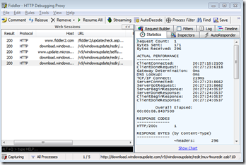

During an Application Compatibility webcast I attended recently the presenter mentioned the Fiddler Tool. There are many network traffic monitoring Tools out there, but if you are just after capturing HTTP traffic, this one should get your attention. 

  *Fiddler is a Web Debugging Proxy which logs all HTTP(S) traffic between your computer and the Internet. Fiddler allows you to inspect all HTTP(S) traffic, set breakpoints, and "fiddle" with incoming or outgoing data*

  Fiddler is FREE and can be downloaded from [here](http://www.fiddler2.com/Fiddler2/version.asp) and some demonstration videos [here](http://www.fiddler2.com/Fiddler/help/video/)

