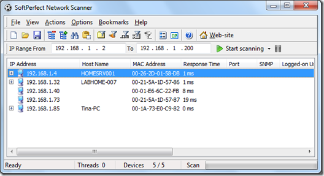

Just found another nice FREE Utility. As the name says [SoftPerfect](http://www.softperfect.com/) Network Scanner allows you to scan your network and allows you to find any IP, NetBIOS or SNMP enabled devices. The tool also supports Remote WMI, Registry and Service access that can be customized to your own needs. 

   The Tool does not require installation. Download SoftPerfect Network Scanner from [here](http://www.softperfect.com/products/networkscanner/)

