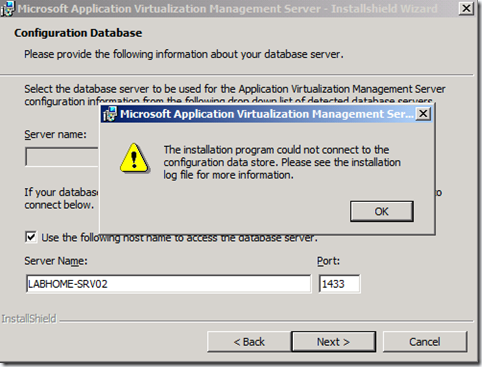
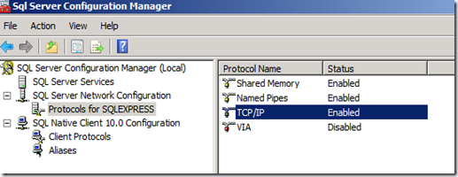
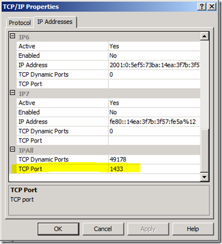
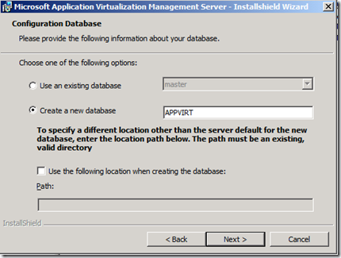

During the Installation of the App-V Management Server on a Windows Server 2008 with SQL Server 2008 Express installed I ran into an problem specifying the database server and got an error as shown in the picture below. 

*The installation program could not connect to the configuration data store. Please see the installation log file for more information.*

I solved the problem by opening the SQL Server Configuration Manager and enabled TCP/IP in the SQL Server Network Configuration options.

 Within the Properties specify Port 1433 as shown in the picture below.

Finally restart the SQL Server Service. Once the SQL Service has restarted the App-V Management Server installation Wizard should find the SQL Server Instance.

Update: May, 2010, although I managed to get this running with SQL 2008, i recommend using SQL 2005 as that to my knowledge is the official supported SQL Database. Any inputs welcome.

