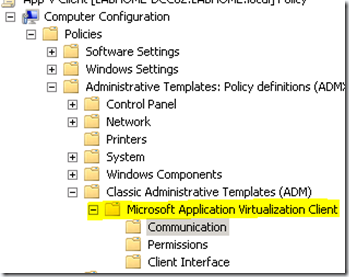
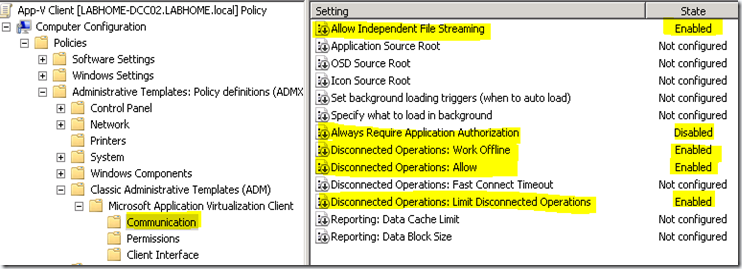
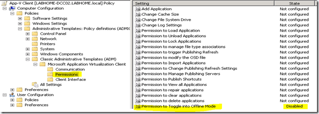

If you plan to use the Microsoft App-V Stand-Alone Mode some Registry Settings are required for the Application Virtualization Client as described in detail on this App-V site [here](http://www.app-v.in/standalone.php). But instead of setting these registry keys manually or through a custom script, you can also manage these settings through Group Policy. 

  First download the [Microsoft Application Virtualization Administrative Template (ADM Template)](http://www.microsoft.com/downloads/details.aspx?FamilyID=67CDF9D2-7E8E-4D76-A552-FD82DBBFF9BC&displaylang=en). The ADM Template provides configuration options for the App-V 4.5/4.6 Client settings such as Client Permissions, Client Interface behavior and Client Communication Settings. 

  Once you have added the ADM Template to your GPO object you can find them under the “Classic Administrative Templates (ADM)” branch as shown in the picture below. 

  

  Then configure the Group Policy Settings as shown below.   

  Once the GPO is enabled run the command  gpupdate /force on the client to ensure that all GPO settings get applied. Then open the Registry Editor and validate that all settings are configured as described [here](http://www.app-v.in/standalone.php)

  Now install your previously sequenced application through the generated MSI installation package. If all goes well, you should be able to launch your Virtual Application in Stand-Alone mode now. 

  **Additional Resources:**    
[Microsoft App-V 4.5 Client in Stand Alone Mode Whitepaper by Tim Mangan](http://www.tmurgent.com/WhitePapers/Microsoft_AppV_Stand-Alone.pdf)    
[App-V 4.6 Release Q & A](http://windowsteamblog.com/blogs/springboard/archive/2010/02/22/app-v-4-6-release-q-amp-a.aspx)    
[TechNet Virtual Lab: Learning to Configure App-V for Standalone Client Mode](https://www.microsoft.com/resources/virtuallabs/step2-technet.aspx?LabId=ac253a8b-e390-4011-b377-115231841072&BToken=reg)

