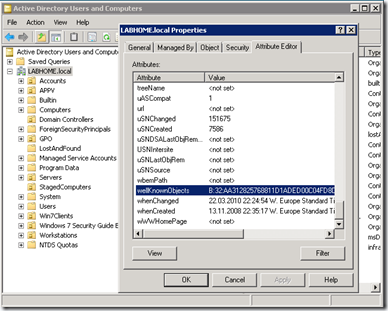
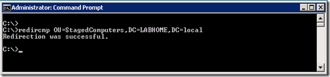
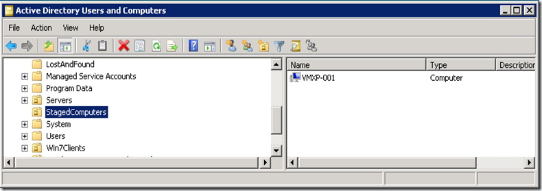

When joining a Computer to an Active Directory domain using the Domain Join UI in Windows or a command line tool such as NETDOM.EXE, by default the computer object is stored in the **Computers** container which is defined as the default Container in Active Directory for new created Computer objects. 

  The disadvantage of this is that you cannot link any Group Policies to the Computers container which prevents you from applying any Computer security or configuration settings to these clients. 

  Before we’re going to change this behavior let’s have a look at where this information is actually stored. Open the Active Directory Users and Computers or the ADSI Edit snap-in and select the Domain Properties from the context right click menu, then select the Attribute Editor Tab. 

  The default Container data for new Computer objects is stored within the wellKnownObjects attribute. 

  But when you double click the Attribute, you will get an error that there is no editor registered to handle that attribute type. I did not look any further into this, but assume that this attribute is protected against manual changes. To still get access to the data that is stored within this attribute I used the [Active Directory Explorer](http://technet.microsoft.com/en-us/sysinternals/bb963907.aspx) from the Sysinternals Suite. 

  The wellKnownObjects Attribute contains the following data:

  98 39 240 175 31 194 65 13 142 59 177 6 21 187 91 15, CN=NTDS Quotas,DC=LABHOME,DC=local   
244 190 146 164 199 119 72 94 135 142 148 33 213 48 135 219, CN=Microsoft,CN=Program Data,DC=LABHOME,DC=local    
9 70 12 8 174 30 74 78 160 246 74 238 125 170 30 90, CN=Program Data,DC=LABHOME,DC=local    
34 183 12 103 213 110 78 251 145 233 48 15 202 61 193 170, CN=ForeignSecurityPrincipals,DC=LABHOME,DC=local    
24 226 234 128 104 79 17 210 185 170 0 192 79 121 248 5, CN=Deleted Objects,DC=LABHOME,DC=local    
47 186 193 135 10 222 17 210 151 196 0 192 79 216 213 205, CN=Infrastructure,DC=LABHOME,DC=local    
171 129 83 183 118 136 17 209 173 237 0 192 79 216 213 205, CN=LostAndFound,DC=LABHOME,DC=local    
171 29 48 243 118 136 17 209 173 237 0 192 79 216 213 205, CN=System,DC=LABHOME,DC=local    
163 97 178 255 255 210 17 209 170 75 0 192 79 215 216 58, OU=Domain Controllers,DC=LABHOME,DC=local    
**170 49 40 37 118 136 17 209 173 237 0 192 79 216 213 205, CN=Computers,DC=LABHOME,DC=local**    
169 209 202 21 118 136 17 209 173 237 0 192 79 216 213 205, CN=Users,DC=LABHOME,DC=local

  Now that we know where the information is stored, let’s change it. I mentioned before that editing the wellKnownObjects Attribute through the AD snap-in tools isn’t possible, and that’s probably for a good reason. But Microsoft has been kind enough to provide a command line tool for this called redircomp.exe which is located in the %SystemRoot%\System32 folder on Windows Server 2003/2008 systems. 

  Before running redircomp.exe a new Organizational Unit must be created where we want to store the computer objects. For this example I created an OU called **StagedComputers**. I then ran the following command:  redircmp OU=StagedComputers,DC=LABHOME,DC=local

  

  Now let’s go back to the Active Directory Explorer and open the wellKnownObjects Attribute where we will see the change. 

  **170 49 40 37 118 136 17 209 173 237 0 192 79 216 213 205, OU=StagedComputers,DC=LABHOME,DC=local**    
98 39 240 175 31 194 65 13 142 59 177 6 21 187 91 15, CN=NTDS Quotas,DC=LABHOME,DC=local    
244 190 146 164 199 119 72 94 135 142 148 33 213 48 135 219, CN=Microsoft,CN=Program Data,DC=LABHOME,DC=local    
9 70 12 8 174 30 74 78 160 246 74 238 125 170 30 90, CN=Program Data,DC=LABHOME,DC=local    
34 183 12 103 213 110 78 251 145 233 48 15 202 61 193 170, CN=ForeignSecurityPrincipals,DC=LABHOME,DC=local    
24 226 234 128 104 79 17 210 185 170 0 192 79 121 248 5, CN=Deleted Objects,DC=LABHOME,DC=local    
47 186 193 135 10 222 17 210 151 196 0 192 79 216 213 205, CN=Infrastructure,DC=LABHOME,DC=local    
171 129 83 183 118 136 17 209 173 237 0 192 79 216 213 205, CN=LostAndFound,DC=LABHOME,DC=local    
171 29 48 243 118 136 17 209 173 237 0 192 79 216 213 205, CN=System,DC=LABHOME,DC=local    
163 97 178 255 255 210 17 209 170 75 0 192 79 215 216 58, OU=Domain Controllers,DC=LABHOME,DC=local    
169 209 202 21 118 136 17 209 173 237 0 192 79 216 213 205, CN=Users,DC=LABHOME,DC=local

  Finally I joined a Windows XP client called VMXP-001 to the LABHOME domain and the Computer object was automatically created within the StagedComputers OU. 

   

  Note that the same can be done for User Objects as well. For more Information read the Microsoft KB [Redirecting the users and computers containers in Active Directory domains](http://support.microsoft.com/default.aspx?scid=kb;en-us;324949)

