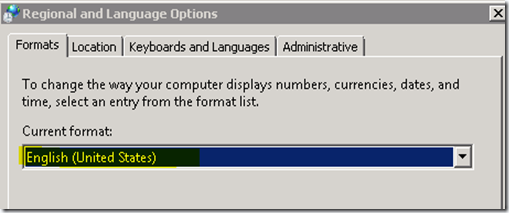

I’ve spend about 2 hours tonight getting SQL Server 2008 Express installed on a Windows Server 2008 system…….. Launched the installation package, it started extracting it’s content, it made an attempt to launch the embedded setup.exe and then…..Nothing.

  The temporary folder that holds the extracted installation files got deleted and all that was left was the below error log.

  03/09/2010 23:22:48.079 ======================================================================
03/09/2010 23:22:48.235 Setup launched
03/09/2010 23:22:48.282 Attempting to determine media source
03/09/2010 23:22:48.329 Media source value not specified on command line argument.
03/09/2010 23:22:48.360 Setup is launched from media directly so default the value to the current folder.
03/09/2010 23:22:48.407 Media source: c:\3c583b87cb85226328b6ae0c9d\
03/09/2010 23:22:48.454 Attempt to determine media layout based on file 'c:\3c583b87cb85226328b6ae0c9d\mediainfo.xml'.
03/09/2010 23:22:49.454 The folder 'c:\3c583b87cb85226328b6ae0c9d\' does not contain a valid media info file 'mediainfo.xml'.
03/09/2010 23:22:49.517 Setup closed with exit code: 0x84C4001E
03/09/2010 23:22:49.579 ======================================================================

  **Solution !**

  I had to find out that for whatever reason the “Format” within the Regional Settings was not set to English. After setting this to English the installation executed and completed successfully.

  

