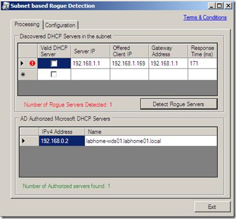

If you ever experience an issue where clients don’t get correct IP addresses or your PXE Service might not work or respond, then before knocking on the Network guy’s door, you might want to run the RogueChecker utility. The RogueChecker utility is a nice little FREE tool that can help detecting rogue (misconfigured or unauthorized) DHCP servers in your network. 

  To get the tool reporting a rogue server I enabled both the Microsoft DHCP server and the integrated DHCP Service on our Wireless Access point.  

   

  The tool provides the following features:

     
- The tool can be run one time or can be scheduled to run at specified interval.    
- Can be run on a specified interface by selecting one of the discovered interfaces.    
- Retrieves all the authorized DHCP servers in the forest and displays them.    
- Ability to validate (not Authorize in AD) a DHCP server which is not rogue and persist this information    
- Minimize the tool, which makes it invisible. A tray icon will be present which would display the status. 

  The tool can be downloaded from the [Microsoft Windows DHCP Team Blog](http://blogs.technet.com/teamdhcp/archive/2009/07/03/rogue-dhcp-server-detection.aspx).

