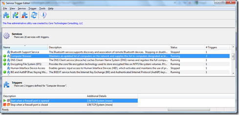

if you found the previous post [Windows 7 Service Triggers](https://www.verboon.info/index.php/2010/03/windows-7-service-triggers/) interesting, then you will like this utility too. The Service Trigger Editor provided by Core Technologies Consulting LLC is a FREE utility providing a UI to list and edit Service Triggers. 

   The Tool can be downloaded from [here](http://www.coretechnologies.com/products/ServiceTriggerEditor/) and is ready to run (no installation required)

