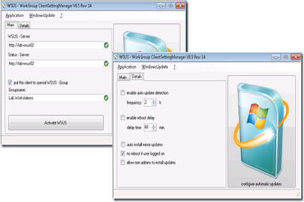

I just found another nice FREE Utility that any Systems Engineer should have who deals with WSUS. The Tool allows you to configure a client’s WSUS settings without having to manually apply any registry settings or you can use the Tool for Troubleshooting purposes. If your clients receive WSUS configuration through Group Policy Settings, you can use the tool to see if all settings are applied correctly. 

   

  The Tool also provides some additional useful functions such as:

     
- Export Windows Update Registry Settings    
- Start and Stop the Windows Update Service    
- Display the Windows Update log    
- Force detect Updates    
- Report to WSUS  

  The Tool written by Daniel Bedarf can be downloaded from the CodePlex [WSUS Client Manager for Workgroups project site](http://wsusworkgroup.codeplex.com/).  I also recommend reading this Microsoft KB [How to read the WindowsUpdate.log file](http://support.microsoft.com/kb/902093/en).

