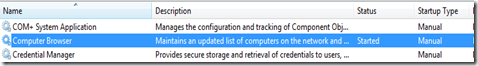
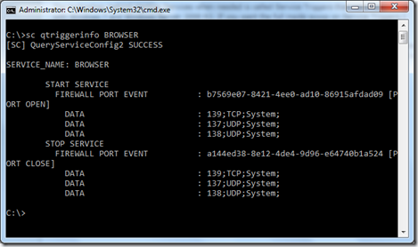
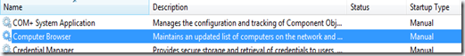
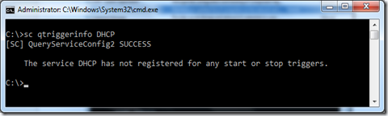

When taking a closer look at the Services in Windows 7 you will notice that many of them are configured to start manually but will be started when needed. For more details read my earlier posts [Windows Services, what changed from Vista to Windows7 Part1](https://www.verboon.info/index.php/2009/04/windows-services-what-changed-from-vista-to-windows7-part1/) and [Windows Services, What changed from Vista to Windows7 – Part2](https://www.verboon.info/index.php/2009/04/windows-services-what-changed-from-vista-to-windows7-part2/). 

  The technology behind starting Services when needed is called Service Triggers that were introduced with Windows 7 and Windows Server 2008 R2. If you want the full inside scoop on Service Triggers I recommend that you read through the content listed below. 

  In simple words Service Triggers help improve system performance by not having Services just running in the background if not needed. Let’s have a look at the Computer Browser Service which by default is configured to start manually but when I took the screenshot it was actually started. 

  

  So let’s open a command prompt and enter the following command:SC qtriggerinfo BROWSER

  As you can see from the above screenshot this Service has Service Triggers defined. The Computer Browser Service will start as soon as the Firewall port opens and stops when these ports are closed. 

  I’m writing this article at home where my laptop is connected to the Wireless LAN, so when I disable my Wireless connection, no traffic should go through the firewall anymore, hence the Computer Browser should stop. And indeed 60 seconds after I have disconnected the laptop from the Wireless LAN, the Computer Browser Service is stopped. 

   Reconnecting the laptop to the Wireless LAN immediately triggers the Computer Browser Service to start again. 

  Now let’s run the same command against another Service: SC qtriggerinfo DHCP

   In this case no Service Triggers are defined. 

   

  **Additional Resources (that will keep you busy for a while)     
**[Windows 7 Trigger-Start Services](http://blogs.microsoft.co.il/blogs/sasha/archive/2009/02/25/windows-7-trigger-start-services.aspx)    
[Windows7 Trigger Start Services – Part 1: Introduction](http://windowsteamblog.com/blogs/developers/archive/2009/10/26/windows7-trigger-start-services-part-1-introduction.aspx)    
[Windows7 Trigger Start Services – Part 2: Building a Trigger Start Optimized Service](http://windowsteamblog.com/blogs/developers/archive/2009/10/27/windows7-trigger-start-services-part-2-building-a-trigger-start-optimized-service.aspx)    
[Chittur Subbaraman: Inside Windows 7 - Service Controller and Background Processing](http://channel9.msdn.com/shows/Going+Deep/Chittur-Subbaraman-Inside-Windows-7-Service-Controller-and-Background-Processing/)     
[How to create a trigger-start Windows service in Windows 7](http://support.microsoft.com/kb/975425)    
[MSDN – Service Triggers](http://msdn.microsoft.com/en-us/library/dd405513(VS.85).aspx)    
[The Code Project - Windows 7 Trigger Start Service](http://www.codeproject.com/KB/cs/Trigger_Start_Service.aspx)    
[Using SC to manage Service Triggers](http://www.coretechnologies.com/products/ServiceTriggerEditor/sc.html)

