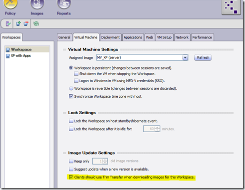
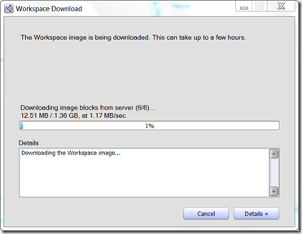
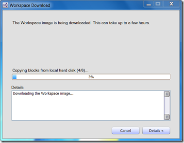

Today I have spend some time in taking a look at MED-V. I reviewed MED-V already about a year ago, but had not touched it since then. Microsoft just recently released an updated version of MED-V as part of the MDOP suite. While configuring a Workspace, my attention was caught by the “*Clients should use Trim Transfer when downloading images for this Workspace*” setting that is shown within the Virtual Machine Tab. 

  

  The [documentation](http://technet.microsoft.com/en-us/library/ff433598.aspx) describes the setting as following:

  *Select this check box to enable Trim Transfer **when downloading images associated with this MED-V workspace. If this check box is cleared, the full image will be downloaded.*

  *Trim Transfer requires indexing the hard drive, which might take a considerable amount of time. It is recommended to use Trim Transfer when indexing the hard drive is more efficient than downloading the new image version, such as when downloading an image version that is similar to the existing version. *

  A detailed description of the MED-V Trim Transfer Technology can be found [here](http://technet.microsoft.com/en-us/library/ff433571.aspx)

  OK, just clicking a check box is not enough , I want to see that. I first configured a Workspace called Workspace and assigned a previously created Windows XP image, once the Image was published on the MED-V Server is launched the MED-V client on a second device. As you can see from the screen shot below, the image is downloaded from the server

   I then created a second Workspace and assigned a slightly different image to it that is based on the first one I created, I just added another application to it. Once that Image was published to the server, I headed over to the MED-V Client device which prompted me that there was another Workspace available, after confirming, it started downloading that other image. But as you can see from the screen shot below, it is actually retrieving the data blocks from the local drive, hence not the complete image is being downloaded from the server again.  

  

