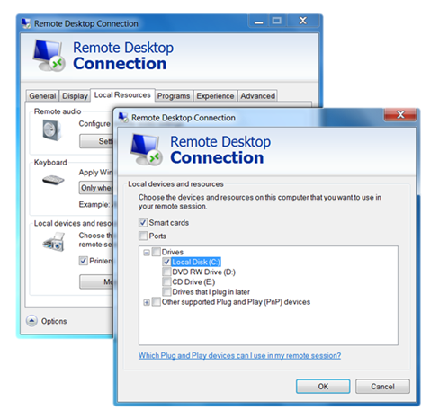

Today I had a problem with copy pasting some content from a RDP session to my local client. I was quite surprised that this didn’t work since I have been using this quite often recently. But as so often, the answer to my problem was quickly found in Google. It appears that I have become so used to work with Windows Server 2008 and 2008-R2 that I had simply forgotten that if you want to use the copy paste functionality to copy **files** between a Server 2003 RDP session and a local client, you must configure a local drive redirection. 

  and as we speak about RDP and copy paste, I would also like to mention the following two interesting blog posts. [Why does my shared clipboard not work? (Part 1)](http://blogs.msdn.com/rds/archive/2006/11/20/why-does-my-shared-clipboard-not-work-part-1.aspx) and [Why does my shared clipboard not work? (Part 2)](http://blogs.msdn.com/rds/archive/2006/11/20/why-does-my-shared-clipboard-not-work-part-2.aspx)

