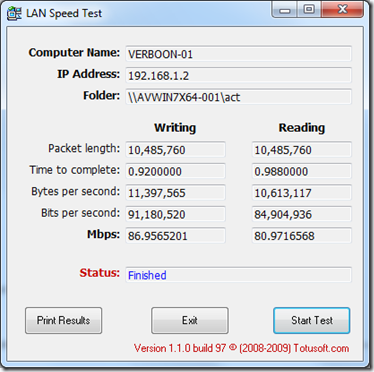

There many tools out there that can measure the network speed between 2 computers, but either you have to pay for them or you need to go through a lengthy installation or configuration process. I want something that is FREE and easy to use. Here’s what I end up with after 30 minutes of browsing the web and doing some test installs of the various tools I found. 

  **Test TCP Utility**

  To measure the network speed between 2 computers you must run the Test TCP Utility on each client. One client will act as the receiver and the other one as the transmitter. So let’s say you want to test the network speed between PC-A and PC-B. 

  First download the Test TCP Utility from [here](http://www.pcausa.com/Utilities/ttcpdown1.htm) then store the downloaded PCATTCP.exe on each of the machines. 

  Open a command prompt on PC-A and run the following command (This client is the receiver, the output is shown in mega bytes)

  PCATTCP –r –f m

  Then open a command prompt on PC-B and run the following command (replace the below 

  PCATTCP –t <IP Address of the receiving PC>

  After a few seconds the results are displayed on both the receiver and transmitter client. 

  PCAUSA Test TCP Utility V2.01.01.11     
Started TCP Receive Test 0...      
TCP Receive Test      
  Local Host  : VERBOON-01      
**************      
  Listening...: On port 5001 

  Accept      : TCP <- 192.168.1.8:50180     
Buffer Size : 8192; Alignment: 16384/0      
Receive Mode: Sinking (discarding) Data      
Statistics  : TCP <- 192.168.1.8:50180      
16777216 bytes in 1.44 real seconds = 89.14 Mbit/sec +++      
numCalls: 3061; msec/call: 0.48; calls/sec: 2131.62

  More Information about Test TCP (Benchmarking Tool and Simple Network Traffic Generator) can be found [here](http://www.pcausa.com/Utilities/pcattcp.htm)

  **LAN Speed Test**

  The other utility I found is called LAN Speed Test provided by [Simple Software Solutions](http://www.totusoft.com/). LAN Speed Test performs the speed test by writing and reading  a file on a remote client. The remote client and file size of the test file can be specified within the UI when starting the test. 

   LAN Speed Test can be downloaded from [here](http://www.totusoft.com/downloads)

