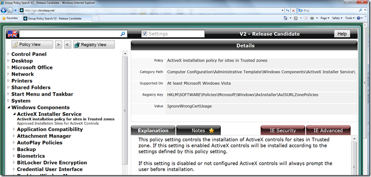

Reading my e-mails near the end of my vacation I received a link to this great web based GPO Search Tool. The tool is quite self explaining, so if you’re dealing with Group Policies have a look [here](http://gps.cloudapp.net/)

  

