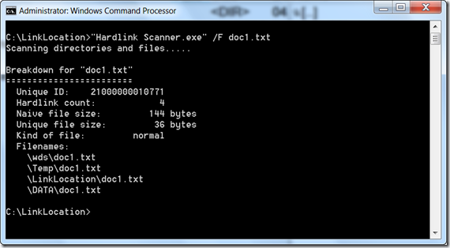

Here’s another nice utility I found today called Hard Link Scanner. Hard Link scanner is a command line tool that scans directories for hard linked files. 

   Download Hard Link Scanner from [here](http://twpol.dyndns.org/projects/hardlink_scanner/)

