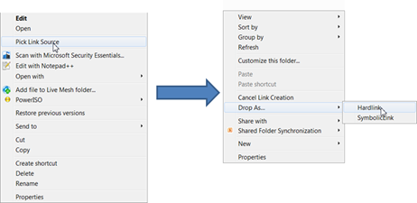

Earlier this week I wrote about [using Hard Links](https://www.verboon.info/index.php/2010/04/using-hard-links-part-one/). By doing my research on this subject I came across the Link Shell Extension utility. As the name says the utility extends the shell with additional options to create hard and symbolic links. So if you don’t want to type commands at the command prompt to create a hard link, this utility is just right for you.

   Additional very detailed [documentation](http://schinagl.priv.at/nt/hardlinkshellext/hardlinkshellext.html#introduction) and utility [download](http://schinagl.priv.at/nt/hardlinkshellext/hardlinkshellext.html#contact) links can be found [here](http://schinagl.priv.at/nt/hardlinkshellext/hardlinkshellext.html#contact). Also look at the [History](http://schinagl.priv.at/nt/hardlinkshellext/hardlinkshellext.html#history) of the utility, the first version was released in 1999 but the most recent version dates from February 2010.

