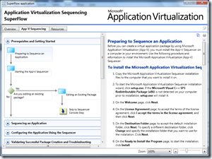

Just learned about these SuperFlows, although some of them were already released a while ago, for some reason I missed that one, well you can’t keep up with everything. Just installed 3 of them, really cool stuff. If you’re dealing with SCCM or App-V, give it a try. 

  The SuperFlow interactive content model provides a structured and interactive interface for viewing documentation. Read more (SCCM) [here](http://blogs.technet.com/configurationmgr/archive/2010/02/11/announcing-the-release-of-configuration-manager-2007-superflows.aspx) and (App-V) [here](http://blogs.technet.com/appv/archive/2010/04/29/the-application-virtualization-sequencing-superflow-has-been-released.aspx)

       

   **Available SuperFlows     
**[System Center Configuration Manager 2007 Software Updates Synchronization SuperFlow](http://www.microsoft.com/downloads/details.aspx?familyid=D509A9F4-E397-4D0A-89BB-FA3D68B9E8BE&displaylang=en)    
[Software Updates Synchronization SuperFlow](http://www.microsoft.com/downloads/details.aspx?familyid=D5B3D7D7-0DBF-4A05-A2B6-4D4AAC97480C&displaylang=en)    
[Software Update Deployment SuperFlow](http://www.microsoft.com/downloads/details.aspx?familyid=A8D785F6-3BF7-4D98-8B4E-2C7C77DD0C04&displaylang=en)    
[SuperFlow for Operating System Deployment via PXE](http://www.microsoft.com/downloads/details.aspx?displaylang=en&FamilyID=c6f88b60-5dd0-40d4-a7e4-8234b4066d27)    
[Application Virtualization Sequencing SuperFlow](http://www.microsoft.com/downloads/details.aspx?displaylang=en&FamilyID=8c4dfab6-7ef5-4188-a531-346cf9bfe7bf)

