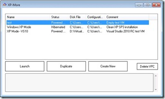

XP-More is a tool that helps manage Windows 7 Virtual Machines (XP Mode and any other). Specifically, it makes duplication of VMs a no brainer - no more raw XML editing and manually duplicating files.

  

   More Information and download details can be found on the CodePlex [XP-More project page](http://xpmore.codeplex.com/)

