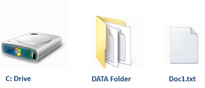
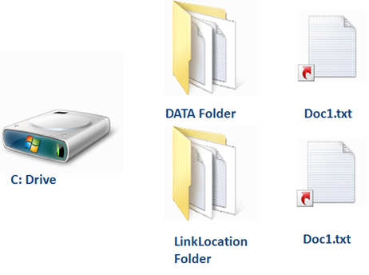
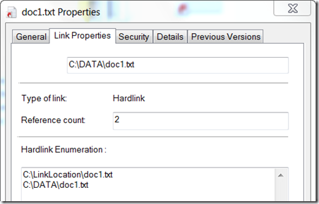

Nowadays we often hear the term **Hard link** in conjunction with Windows 7 deployments, this because the User State Migration Tool 4.0 aka USMT now provides support for hard links. The advantage of using hard links is that there is no explicit need to copy the data away from the machine before installing Windows 7. I plan to write about USMT 4.0 and the use of hard links in another post. The purpose of this article is to provide a practical understanding of what hard links are and how to create them.

So let’s start with a simple scenario. I have a file called **doc1.txt** stored in a folder called **DATA** which is located on my local **C:** Partition.  Now let’s create a hard link for Doc1.txt. Microsoft provides two command line tools to create hard links, FSUTIL.EXE which exists since Windows XP and MKLINK.EXE which was introduced with Windows Vista. While FSUTIL is rather a multi purpose tool for all kinds of File System related configuration tasks, the purpose of MKLINK is specific to create symbolic and hard links.  For this demonstration I am going to use FSUTIL.EXE.

FSUTIL HARDLINK create c:\Linklocation\doc1.txt c:\data\doc1.txt

As shown in the illustration below, we now have a hard link created for Doc1.txt.

 Now this might look like we have just created a copy of the file in a different folder, but that’s not the case as both files point to the same record in the MFT (Master File Table).  To better visualize hard links within Windows Explorer I recommend installing the [hard Link Shell Extension](https://www.verboon.info/index.php/2010/04/tooltip-link-shell-extension/).

Note that after creating the hard link the file symbol shown in the Windows Explorer has changed and now has a red arrow indicating that the file has a link. (this is only shown when you have the Hard Link Shell extension installed)

 When looking at the File Properties, you will notice that there is now an additional Tab called Link Properties (This additional Tab is added by the Hard Link Shell Extension). The Link Properties tab provides information about the type of the link, the number of links and the linked files itself.

If now we open Doc1.txt located in C:\DATA with Notepad and add some additional text and then save the file, we will see that if we open Doc1.txt located in C:\LinkLocation the same content is displayed. But be careful, if you open and edit a file that has a hard link with Microsoft WinWord or Excel and save it, you will not see the added content within one of the other linked files, this because WinWord and Excel (and probably other applications as well) break the hard link. But only for the file that was edited, hence if you have a file that has 3 hard link references, then the other two files will remain linked.

In my next posts about Using Hard Links I will share some practical examples of using hard links plus share some insight on what is happening when using USMT 4.0 with hard links.

If you want to read more about hard links, I recommend reading the content listed below.

**Additional Resources
**[MSDN - Hard Links and Junctions](http://msdn.microsoft.com/en-us/library/aa365006(VS.85).aspx)
[Wikipedia = Hard Link](http://en.wikipedia.org/wiki/Hard_link)
[Engineering Windows 7 – Disk Space](http://blogs.msdn.com/e7/archive/2008/11/19/disk-space.aspx)

