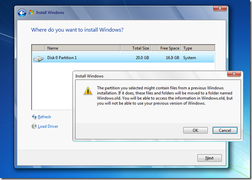
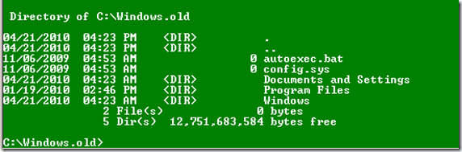
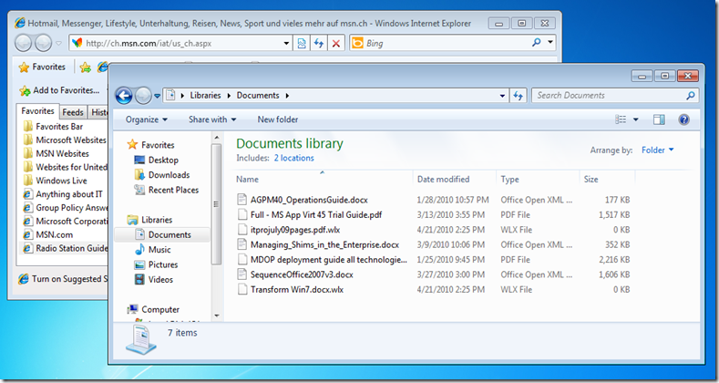

In my previous post [Using hard Links – Part One](https://www.verboon.info/index.php/2010/04/using-hard-links-part-one/) I explained how Hard Links work. Today’s post is about using hard links with USMT 4.0 in a Windows XP to Windows 7 migration scenario.

  A typical client migration scenario for an end user usually consists of the following processes:

- User Data and Settings backup
- Operating System Migration
- Application Installation
- User Data and Settings Restore

  When migrating to previous versions of Windows in most cases IT support personnel first had to copy the users data of the machine to an external USB device or network drive, this depending on the volume of data could consume quite some time, then when the new OS was installed that same data had to be restored back to the local device. With the release of USMT 4.0 IT Engineers can now design a migration process that leverages hard link functionality, which means that there is no need anymore to copy the data off the device that is being migrated. You can imagine that this will significantly speed up the overall duration of migrating a client to Windows 7.

  Now let’s take a look how that works. We have a Windows XP SP3 client with a local user account “JohnDoe”. I gave John Doe some documents that I stored in his My Documents folder and added some Internet Explorer Favorites.

  Next I copy the USMT 4.0 binaries from my local WAIK installation source (c:\Program Files\Windows AIK\Tools\USMT\x86) on to the Windows XP client into the  C;\Tools folder. Then I run the following command with an Administrative account.

  C:\tools\USMT\SCANSTATE **c:\migdata /hardlink /nocompress** /i:migUser.xml /i:migdocs.xml /i:migapp.xml

Once completed I verify that the C:\migdata folder contained the hard linked data and then continue with installing Windows 7. At the beginning of the Installation process I choose the “Custom Installation” option (Upgrade isn’t possible for Windows XP). On the disk configuration screen I select *Next* without changing or formatting the drives. (don’t format any drives as this would destroy your local DataStore).

  The Installation process prompts me with the message shown in the picture below, which i confirm this with *OK*.

   When Windows Setup is completed its initial phase I boot the system into WinPE, just to see how things are on the local disk. As shown in the picture below, all the folders related to the Windows XP Operating System were moved into the Windows.old folder. Any folders that were created in the root of the drive remain untouched.

  

  I then reboot the system and did let Windows 7 complete its installation. Once completed I log on to the system. Now let’s take a look at the status of the hard links. Running the [HardLink Scanner tool](https://www.verboon.info/index.php/2010/04/tooltip-hardlink-scanner/), we can see that he files have a hard link. Below the output from one of the migrated files:

  Breakdown for "c:\migdata\USMT\File\C$\Documents and Settings\JohnDoe\My Documents\Full - MS App Virt 45 Trial Guide.pdf"
=========================================================================================================================
  Unique ID:     1000000004118
**  Hardlink count:            2**
  Naive file size:   3,106,172 bytes
  Unique file size:  1,553,086 bytes
  Kind of file:         normal
  Filenames:
    \Windows.old\Documents and Settings\JohnDoe\My Documents\Full - MS App Virt 45 Trial Guide.pdf
    \migdata\USMT\File\C$\Documents and Settings\JohnDoe\My Documents\Full - MS App Virt 45 Trial Guide.pdf

  The last step to get John Doe’s personal data and settings back into his profile is done by running the following USMT loadstate command.

  C:\tools\USMT\loadstate **c:\migdata** **/hardlink /nocompress** /auto

  When logging in with John Doe’s account, we can see that his personal data and Favorites are back.

  

  Let’s take a look at the hardlink status of our migrated files. When running the hardlink scanner tool against one of the migrated files we get the following output:

  Breakdown for "c:\migdata\USMT\File\C$\Documents and Settings\JohnDoe\My Documents\Managing_Shims_in_the_Enterprise.docx"
=========================================================================================================================
  Unique ID:     1000000004117
  **Hardlink count:            3**
  Naive file size:   1,081,188 bytes
  Unique file size:    360,396 bytes
  Kind of file:         normal
  Filenames:
    \Users\JohnDoe\Documents\Managing_Shims_in_the_Enterprise.docx
    \Windows.old\Documents and Settings\JohnDoe\My Documents\Managing_Shims_in_the_Enterprise.docx
    \migdata\USMT\File\C$\Documents and Settings\JohnDoe\My Documents\Managing_Shims_in_the_Enterprise.docx

  So we now have 3 links.

- The first one relates to the file stored within the Documents folder of John Doe’s new Windows 7 profile.
- The second one relates to the file stored in the My Documents folder of John Doe’s old Windows XP profile
- The third one relates to the file stored within the USMT Data Store.

  Now that we have successfully migrated John Doe’s personal data and settings, we can get rid of the USMT Data Store and the data stored under the previous Windows XP location. The USMT DataStore can be easily removed by using the usmtutils.exe which is included in the USMT Toolkit.

  usmtutils.exe /rd **C:\migdata**

  Now we only have to take care of the Windows.old folder, to get rid of that one follow the instructions as described in the Microsoft KB article [How to use the Disk Cleanup feature to delete the Windows.old folder after you install Windows Vista](http://support.microsoft.com/kb/930527/en-us) (the content also applies for Windows 7).

  So there is no need to backup data when using hard links? Well put it like this, if you are migrating a user that has business critical data stored on this device, I would still recommend to get a copy of their data on an external device or network drive, this might again add some time to the migration process, but at least, when all goes well you save the time when restoring the data from the local (hard link) data store.

  That’s it, I hope these two posts were useful and provided you with some insight on how to use USMT with hard links.

