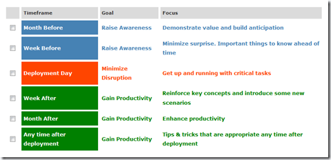

One of the objectives of deploying a new operating system within an Enterprise is to provide end users with a state of the art Operating System that builds the foundation for adopting new technologies and to increase end user productivity. 

  IT departments usually spend months in preparing an enterprise wide desktop deployment and by doing so they automatically get familiar with all the new functionality and features of the new Operating System. But what about the end users? Most end users are not involved in all the preparation and planning activities, hence they will only see the new Operating System on the day their PC is being migrated. 

  So unless one has recently bought a new home PC that has Windows 7 pre-installed, users will be confronted with a complete new User Interface. Windows 7 is far more intuitive than previous Windows Operating Systems,nevertheless users will need to go through a learning curve to manage their new device. Furthermore to boost end user productivity it is important that end users become familiar with the new features and functionality as otherwise there is a risk that they continue to use their device without using these. 

  To help Enterprises preparing their end users and IT support staff in creating the awareness and becoming familiar with the new features and functionality of Windows 7 and Office, Microsoft has put in place the Enterprise Learning Framework. 

   

   The Enterprise Learning Framework helps with:

     
- **Raising Awareness**: Helping employees understand how the new versions of Windows and Office will benefit them and helping to prepare employees before deployment     
- **Minimizing Disruption**: Identifying a small, manageable number of learning topics to get employees up and running quickly with Windows 7, Windows Vista and the 2007 Office release     
- **Shortening Training**: Concise learning topics requiring only a few minutes each from employees     
- **Gaining Productivity**: Identifying the most important learning topics for improving productivity as employees continue to use Windows 7, Windows Vista and the 2007 Office release  

  The Enterprise Learning Framework portal allows IT departments prepare end user training content. The process of preparing the content is very straight forward. 

     
- Choose Products    
- Define User Profile    
- Refine Topics 

  When completed the tool can automatically generate an e-mail message or Word Document that contains all the required training content. To avoid overloading end users with too much information at once, the tool allows to define the actual timeframe. 

   

  For more information or start preparing the end user training content visit the [Enterprise Learning Framework](http://www.microsoft.com/technet/desktopdeployment/bdd/ELF/Welcome.aspx) portal.

