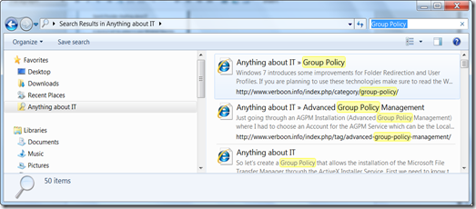

Inspired by the [Windows 7 Federated Search](http://windowsteamblog.com/blogs/developers/archive/2010/04/18/windows-7-federated-search.aspx) blog post I created a Search Extender for my Anything about IT blog. You can download the Anything About IT Search Provider from [here](https://www.verboon.info/fun/aait_search_extender.zip)

  Once you have downloaded the ZIP file, unpack aait.osdx and double click to install. You will see the following message. Click Add to install the Anything about IT Search Provider. 

   Once installed you can directly search for content on Anything about IT from your Windows Explorer. 

   More Windows 7 Search Providers can be found [here](http://www.sevenforums.com/tutorials/742-windows-7-federated-search-providers.html)

  **Additional Resources**     
[Federated Search Blog](http://federatedsearchblog.com/)     
[OpenSearch.org](http://www.opensearch.org/Home)     
[Windows 7 Federated Search Provider Implementer's Guide](http://www.microsoft.com/downloads/details.aspx?familyid=c709a596-a9e9-49e7-bcd4-319664929317&displaylang=en&tm)

