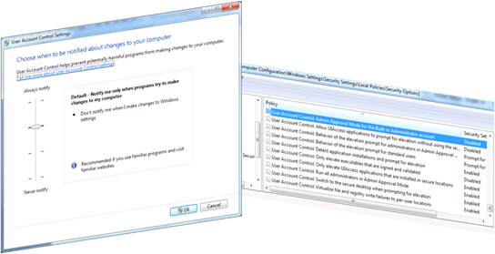

Today I spend a bit of time in refreshing my UAC knowledge, below a listing of the content I’ve been reading and watching. 

   

  **Reading (Blogs & TechNet)**     
[User Account Control in Windows 7 Best Practices](http://technet.microsoft.com/en-us/library/ee679793(WS.10).aspx)     
[UAC Architecture](http://technet.microsoft.com/en-us/library/dd835540(WS.10).aspx)     
[Inside Windows 7 User Account Control](http://technet.microsoft.com/en-us/magazine/2009.07.uac.aspx)     
[The Windows 7 UAC Slider, and What You Can Do on Windows Vista Today](http://blogs.msdn.com/cjacks/archive/2009/01/07/the-windows-7-uac-slider-and-what-you-can-do-on-windows-vista-today.aspx)     
[Engineering Windows 7 - User Account Control](http://blogs.msdn.com/e7/archive/2008/10/08/user-account-control.aspx)     
[UAC Prompt From Java: CreateProcess error=740, The requested operation requires elevation (ShellExecuteEx Runas Example)](http://mark.koli.ch/2009/12/uac-prompt-from-java-createprocess-error740-the-requested-operation-requires-elevation.html)     

  [UAC Group Policy Settings and Registry Key Settings](http://technet.microsoft.com/en-us/library/dd835564(WS.10).aspx)

     
    
**Video’s**     
[Paul Cooke talks User Account Control](http://edge.technet.com/Media/Paul-Cooke-talks-User-Account-Control/)     
[Windows 7 Security Overview](http://edge.technet.com/Media/Windows-7-Security-Overview/)

