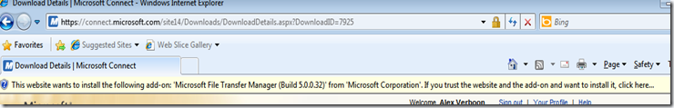
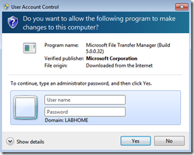
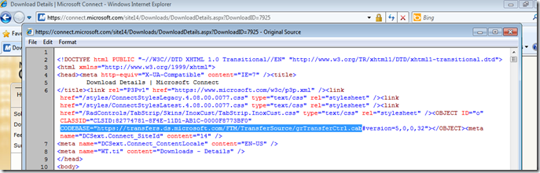
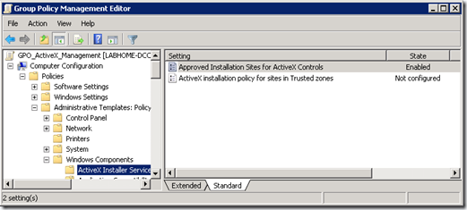
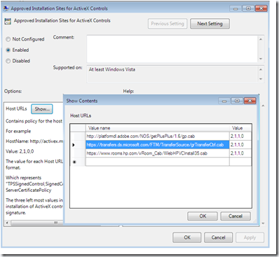
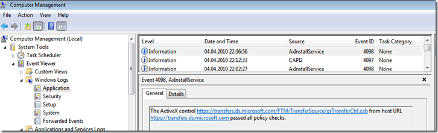
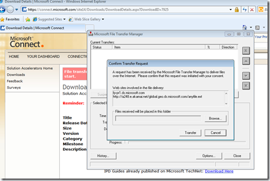

Managing ActiveX Components within an enterprise sometimes can be a pain. Users with standard user privileges by default can’t install ActiveX components, hence whenever a larger group of users require an ActiveX component you usually end up creating a software package and distribute it via Software Distribution or you provide them with temporary Administrative rights. But if the clients are running Windows Vista or Windows 7 there is another solution available I noticed many people aren’t aware of, hence that’s why I am writing this article. 

  The Solution is the Windows ActiveX Installer Service. Using the Windows ActiveX Installer Service allows Enterprise Administrators to manage the deployment of ActiveX controls through Group Policy Settings. On Windows Vista the ActiveX Installer Service is not installed by default but can be added as a feature. On Windows 7 the Service is installed by default. 

  Configuring the ActiveX Installer Service through Group Policy can be done in two ways. Either by specifying the ActiveX Control installation URL or by configuring trusted sites. I am going to use the first option to demonstrate the configuration and behavior of the ActiveX Installer Service. 

  Most of you will be familiar with the Microsoft Connect, MSDN Subscriber Download or TechNet subscriber download Site that uses the File Transfer Manager for downloading content. When trying to download content from one of the above mentioned web sites for the first time with a standard user you will be prompted with a message as shown in the picture below. 

   

  But as soon as you allow the Add-on to be installed, you will be prompted to provide a user name and password of a user that has administrative privileges to allow the installation to continue.  

   This is what would happen in an enterprise environment where users access a website that requires the installation of an ActiveX control. So let’s create a Group Policy that allows the installation of the Microsoft File Transfer Manager through the ActiveX Installer Service. 

  First we need to know the URL that points to the ActiveX Control installation file, which is usually a CAB file but can be an OCX or DLL file as well. To find out the URL of the Microsoft File Transfer Manager I open the web site’s source and search for the word “CODEBASE”. 

  

  Now that I know the location that points to the CAB file, I open the Group Policy Management Console and create a new GPO called GPO_ActiveX_Management. Within the new created GPO I navigate to the ActiveX Installer Service which is located under Computer Configuration, Policies, Administrative Templates, Windows Components. 

   

  I then enable the "Approved Installation Sites for ActiveX Controls” setting and add the Site name https://transfers.ds.microsoft.com/FTM/TransferSource/grTransferCtrl.cab and set the Installation control value to 2,1,1,0. 

   To ensure that the GPO settings is applied to my client I run GPUPDATE at the command prompt. Now when i launch the website again that tries to install the Microsoft File Transfer Manager there is no User Account Control prompt anymore, this because i have now configured this site as an approved site to install an ActiveX control. 

  When opening the Services list within the Microsoft Management Console, I can see that the Service has been started and looking at the Windows Application log I can see that the URL was identified as a secure location. 

   So after a few seconds, the Microsoft File Transfer Manager is successfully installed without having to provide administrative privileges. 

  

  If you’re interested in using the ActiveX Installer Service in your environment I recommend that you also read the below referenced articles.

  **Additional Resources     
**[The ActiveX Installer Service in Windows Vista](http://technet.microsoft.com/en-us/magazine/2007.07.axis.aspx)    
[Microsoft TechNet – ActiveX Installer Service](http://technet.microsoft.com/en-us/library/ee732027(WS.10).aspx)    
[NirSoft - ActiveXHelper](http://www.nirsoft.net/utils/axhelper.html)

