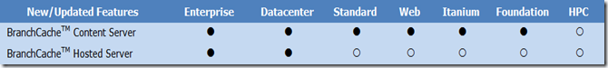
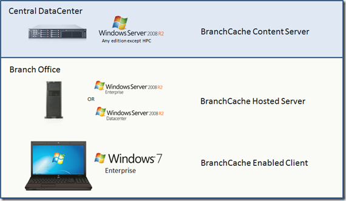

Windows Server 2008 R2 is available in multiple editions. If you’re planning to deploy BranchCache it’s important to consider installing the right server edition as there is a difference in the provided functionality between the different server editions. 

  **Windows Server 2008 R2 BranchCache Features     
**  
Source: [http://www.microsoft.com/windowsserver2008/en/us/r2-differentiated-features.aspx](http://www.microsoft.com/windowsserver2008/en/us/r2-differentiated-features.aspx)

  **BranchCache Content Server**    
Source repository, located at the main office, for the content that is accessed by client computers in branch offices. Content may reside on either a file server with the **BranchCache for Network Files** role service of the File Services server role installed, or on a Web server or BITS-based application server with the BranchCache feature installed. Content servers transmit content to branch offices using the BranchCache-compatible protocols.

  **BranchCache Hosted Server**    
When BranchCache is deployed in hosted cache mode, hosted cache servers in branch offices cache content and provide the content on request to client computers in the same branch office. In this mode, client computers perform the initial download of content from content servers at the main office, and hosted cache servers later download the content from the clients.

  Source: [http://technet.microsoft.com/en-us/library/ee307962(WS.10).aspx#BKMK_2](http://technet.microsoft.com/en-us/library/ee307962(WS.10).aspx#BKMK_2)

  So when you plan to use BranCache in **Hosted Cache Mode** you will need to place the server editions as shown in the illustration below

  

