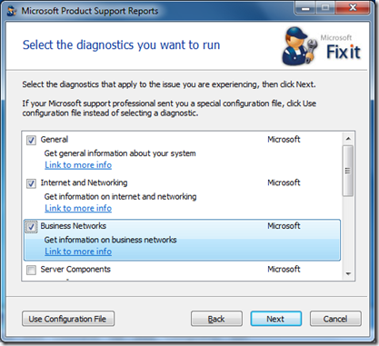
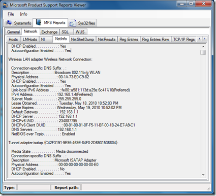

If you get tasked to do some system troubleshooting and you just want to get as many information possible from a client, then have a look at the Microsoft Product Support Report Tool and the Product Support Reports Viewer.

  The Microsoft Product Support Reports Viewer 2.0 can be downloaded from [here](http://www.microsoft.com/downloads/details.aspx?familyid=FB414A72-CCEF-4F14-8C76-B846A0F2182D&displaylang=en) and the Microsoft Product Support Reports from [here](http://www.microsoft.com/downloads/details.aspx?displaylang=en&FamilyID=cebf3c7c-7ca5-408f-88b7-f9c79b7306c0#filelist)

  First launch the Microsoft Product Support Tool, which is a self-extracting executable (no installation needed). Once launched you can select the diagnostics you want to execute, then select Next to get the Diagnostic (Data Collection) started. Note that depending on the diagnostics selected, this process can take a while (up to 25 minutes).

  

  Once the Diagnostic process has completed you can browse, e-mail or save the results. When saving the results, all data is stored in a single CAB file.

  The Microsoft Product Support Report Viewer provides an interface to view the collected diagnostic data, which consists of several individual XML files.

  

  While the diagnostic tool was running on my client, I copied the content of the temporary folder that the tool creates within the users TEMP folder into another folder. (if you have many folders in your TEMP folder just sort by date, and open the one with the newest date).

  Within that folder you will find a Tools folder which contains all the executables and scripts used by the Diagnosis Tool.

  So next time you get one of these famous calls to help solving a system problem, consider using this tool to gather detailed system information data.

