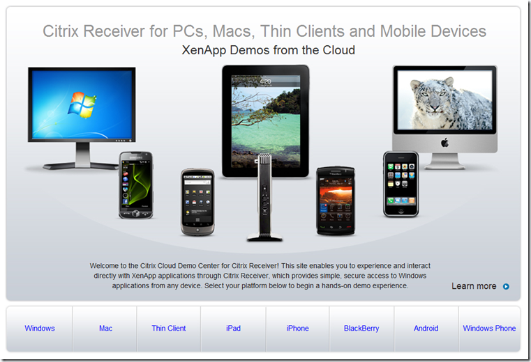
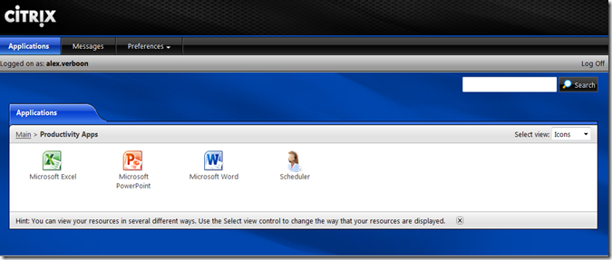
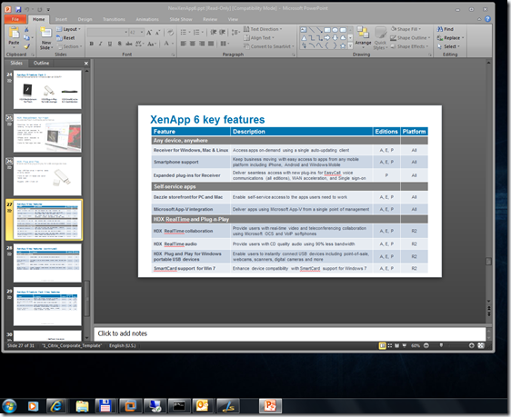

In these days we hear a lot about Desktop Virtualization and Application Virtualization. Last week-end someone asked me what I was currently doing and I told him that beside my normal day job, I am doing a number of Citrix trainings. Now let me mention that this person is just a regular user who doesn’t know anything about managing an Enterprise IT infrastructure, leave alone he would understand what Virtualization technology is about. Heck… how to explain Application Virtualization, Streaming, VDI to an ordinary mortal?

  Well here we go, Citrix has a Test Drive for Citrix XenApp, you can access it through [http://citrixcloud.net/](http://citrixcloud.net/). Just click on one of the Devices and register for a demo account, once submitted you will receive almost instantly a demo account and URL to connect to the Citrix XenApp Demo. 

   

  Once you have installed the Citrix Plug-in you’re ready to launch the Demo. 

  

  When launching Microsoft Word for the first time it took approx. 42 seconds to start it. Once started, i left Word open and launched Microsoft Excel and Microsoft Power Point, both started within approximately 5 seconds. I then closed all the Applications again and launched Excel, that took just 25 seconds to start. I left it open and launched Powerpoint and Word again, both opened within 5-10 seconds. 

  Below a screenshot from Power Point. It integrates seamlessly, you actually wouldn’t notice that the application isn’t executed locally. 

   

  if you haven’t seen XenApp in action, I definitely recommend you give this a try.

