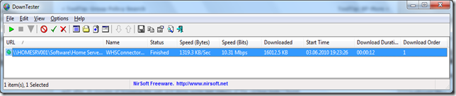

Back in April i posted an article about [Testing Network Speed](https://www.verboon.info/index.php/2010/04/testing-network-speed/), here’s another nice utility that allows testing your network speed, and even more. The Utility is called [DownTester](http://www.nirsoft.net/utils/download_speed_tester.html) and is part of the awesome tool collection from [NirSoft](http://www.nirsoft.net/). 

  DownTester allows you to test the download speed via HTTP, FTP, Remote File Shares and any local drives such as your local drive, DVD and USB.

   

  The Tool is FREE and does not need to be installed.

