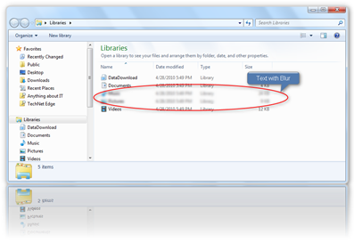

I have seen many FREE Screen Capture tools, but this one beats them all. Screenpresso is a small FREE Screen Capture utility that comes with a lot of nice features and doesn’t require an install. 

  Screenpresso can capture windows, regions, context menus and objects within dialog boxes. Furthermore the tool includes an integrated image editor that allows you to apply various effects such as adding Text, draw a rectangle, blur a selected region and add reflection. 

   You can download Screenpresso from [here](http://www.screenpresso.com/)

