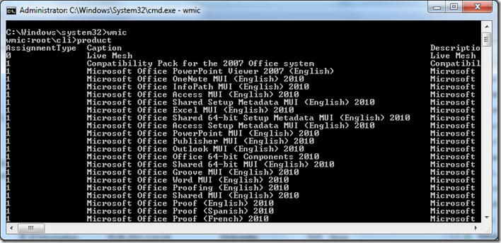
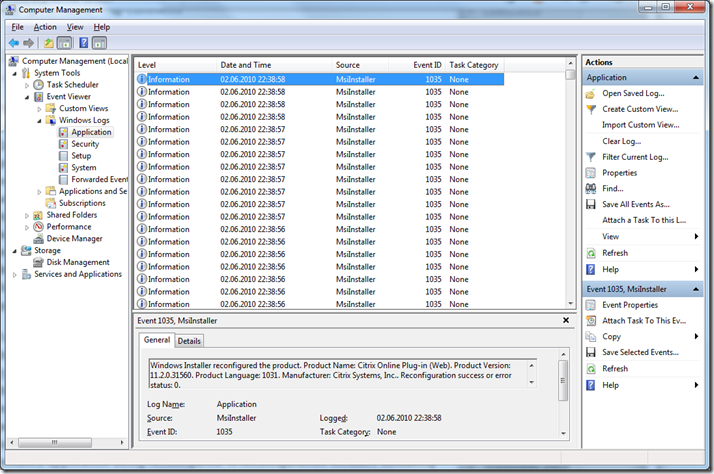

I just read this very interesting article “[Why Win32_Product is Bad News](http://sdmsoftware.com/blog/2010/04/11/why-win32_product-is-bad-news/)!” and if you’re a Desktop Systems Administrator I strongly recommend to the read that article as well. To simulate what [Darren](http://sdmsoftware.com/blog/) is writing about, simply open an elevated command prompt (on a Test system) and type **WMIC**, once WMIC has started type **Product** and confirm with Enter. 

   

  All installed Products will be listed. Now open the Windows Event Viewer. (Eventvwr.msc) and open the Applications log. As shown in the picture below that simply query caused all installed applications to be reconfigured. 

  

