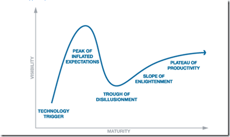

The first time I became familiar with the term **Bring Your Own** was when I traveled through Australia with my wife and oldest son back in the year 2000. It basically means that you are allowed to bring your own bottle of wine to a restaurant and just pay a corkage fee.

  Nowadays we hear a lot about companies that consider implementing a **BYOC** policy meaning that they allow their employees to bring their own computer to work. The idea behind this concept is that companies intend to save money by allowing their users to use their own personal computer instead of having to provide them with a company owned device. In simple words, companies give their employees some money and tell them: *Go buy yourself a PC with a 3 year warranty contract, if you have a problem later, fix it yourself. *

  Now I see some of you thinking No Way, not in my company!. I agree that there is a kind of a contradiction here because during the past 10 years we have all learned that we can only reduce costs by driving standardization meaning keep the number of different hardware as low as possible and have a common configuration across all managed clients. The BYOC approach appears to to move into the opposite direction.

  So is this a good thing or not? To be honest at this stage I am neither for or against it. As a Technology Consultant who works within the desktop management space for many large global companies I see quite some challenges and threads, but that doesn’t mean that I am against the concept as such. I rather think it’s the same as with Virtualization, one size doesn’t fit all, meaning that for some companies or certain user groups the BYOC approach might well fit but definitely not for their entire workforce.

  Although BYOC is not a Technology, If we take [Gartner’s Hype Cycle](http://www.gartner.com/technology/research/methodologies/hype-cycle.jsp#), I believe we are currently at *Stage 1 – Technology Trigger*.

   Many people are talking about BYOC, some even have serious plans to move towards the BYOC concept, but we haven’t seen many large companies that have implemented it, most likely because there are quite some things to consider. I’ll speak more about these in Bring Your Own Computer – Part 2.

  At present when searching for BYOC information on the web, you will automatically hit on Citrix and Intel who both have or are running BYOC pilots. More information about the Citrix BYOC initiative can be found [here](http://www.citrix.com/site/resources/dynamic/news/ForresterBYOC07082009.pdf) and [here](http://www.citrix.com/tv/#videos/2326). Citrix has been quite smart in taking the lead in the BYOC space, because they do provide the Technology that companies will need to consider when applying the BYOC concept. With Citrix XenApp or XenDesktop you can connect with any device to the corporate network but still get access to all centrally managed applications. Have a look at my other blog post [XenApp Demos from the Cloiud](https://www.verboon.info/index.php/2010/05/xenapp-demos-from-the-cloud/) and you will see how that works.

  Now this is a kind of interesting because in the early days of VDI it was often seen as an ultimate cost saver, but meanwhile we have learned that this isn’t always the case, again one size doesn’t fit all. According to [Brian Madden](http://www.brianmadden.com/blogs/brianmadden/archive/2009/05/20/how-far-along-the-hype-cycle-is-vdi-my-guess-is-phase-3-trough-of-disillusionment.aspx) looking at the Hype Cycle VDI today is at *Stage 3 - Trough of Disillusionment*. If we take into account how long it took VDI to get to stage 3, I’m sure it will take a while until we see BYOC widely implemented. Nevertheless I’m almost certain BYOC is something we’ll see more often in the near future and my advice is that even if you have the biggest objections or concerns with the BYOC concept start thinking of how you would handle it within your environment.

  Additional Information / Articles about BYOC:

  [Bring Your Own PC Reinvents The Corporate PC: A Citrix Systems Case Study](http://www.forrester.com/rb/Research/bring_own_pc_reinvents_corporate_pc_citrix/q/id/54875/t/2)

  [BYOC Demystified - Part 1](http://community.citrix.com/display/ocb/2009/05/28/BYOC+Demystified++-+Part+1)

  [BYOC Demystified - Part 2](http://community.citrix.com/display/ocb/2009/06/02/BYOC+Demystified+-+Part+2)

  [BYOC Demystified - Part 3](http://community.citrix.com/display/ocb/2009/06/18/BYOC+Demystified+-+Part+3)

  [Bring your own PC comes despite vexed IT pros](http://searchvirtualdesktop.techtarget.com/news/article/0,289142,sid194_gci1515070,00.html)

  [ATR: Bring Your Own Computer](http://cunninghamabovetherim.blogspot.com/2009/04/atr-bring-your-own-computer.html)

  [WindowsITPro - BYOC: Bring Your Own Computer](http://www.windowsitpro.com/article/deployment/byoc-bring-your-own-computer.aspx)

  [BYOPC – Bring Your Own PC](http://clarkincnet.wordpress.com/2010/05/14/byopc-bring-your-own-pc/)

  [My Recent Presentation On Making BYOPC A Reality](http://ibroughtmyownpc.wordpress.com/2009/10/05/my-recent-presentation-on-making-byopc-a-reality/)

  [Bring Your Own Computer (BYOC) Policies](http://www.thegenerationv.com/2009/11/bring-your-own-computer-byoc-policies.html)

