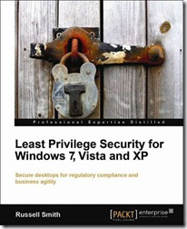

Yesterday I received a pre-release copy of Russel Smith’s book called [Least Privilege Security for Windows 7, Vista and XP](http://www.packtpub.com/least-privilege-security-for-windows-7-vista-and-xp/book?utm_source=verboon.info&utm_medium=bookrev&utm_content=blog&utm_campaign=mdb_004025 ). The book is entirely dedicated to the subject of running Least Privilege Security (or standard user accounts) on Windows operating systems in the enterprise. 

  The book has 420 pages and covers the following topics:

     
- Chapter 1, An Overview of Least Privilege Security in Microsoft Windows     
- Chapter 2, Political and Cultural Challenges for Least Privilege Security     
- [Chapter 3, Solving Least Privilege Problems with the Application Compatibility Toolkit](https://www.packtpub.com/sites/default/files/0042-chapter-3-solving-least-privilege-problems-with-the%20.pdf)     
- Chapter 4, User Account Control     
- Chapter 5, Tools and Techniques for Solving Least Privilege Security Problems     
- Chapter 6, Software Distribution using Group Policy     
- Chapter 7, Managing Internet Explorer Add-ons     
- Chapter 8, Supporting Users Running with Least-Privilege     
- Chapter 9, Deploying Software Restriction Policies and AppLocker     
- Chapter 10, Least Privilege in Windows XP     
- Chapter 11, Preparing Vista and Windows 7 for Least Privilege Security     
- Chapter 12, Provisioning Applications on Secure Desktops with Remote Desktop      
Services,     
- Chapter 13, Balancing Flexibility and Security with Application Virtualization     
- Chapter 14, Deploying XP Mode VMs with MED-V  

   

  You can download the FREE chapter *Solving Least privilege Problems with the Application Compatibility Toolkit*  from [here](https://www.packtpub.com/sites/default/files/0042-chapter-3-solving-least-privilege-problems-with-the%20.pdf)

  I haven’t read the entire book yet, but from what i have seen thus far, it’s definitely a [must have](http://www.packtpub.com/least-privilege-security-for-windows-7-vista-and-xp/book?utm_source=verboon.info&utm_medium=bookrev&utm_content=blog&utm_campaign=md) for any IT Pro who working within the Client Desktop management space. I’ll submit further feedback when I have completed the review.

