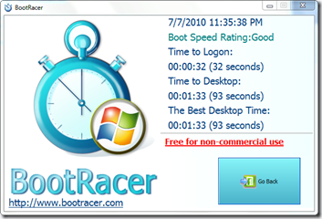

When Microsoft developed Windows 7 a dedicated team was assigned to focus on startup performance. For details, read the [Engineering Windows 7 – Boot Performance](http://blogs.msdn.com/b/e7/archive/2008/08/29/boot-performance.aspx) blog post. So what about your startup performance? . My colleague Rudi vanden Dries has been using a utility called BootRacer since a few months which provides a simple way of measuring system startup performance. 

   Documentation, Download details and a short demonstration video can be found [here](http://www.greatis.com/bootracer/index.html)

