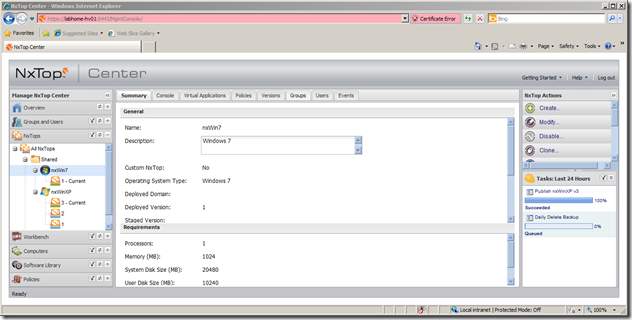
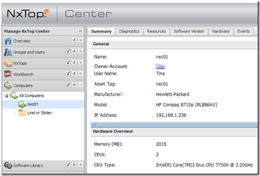
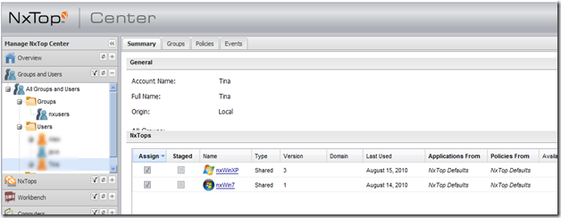

When I watched the VirtualComputer [NxTop video](http://www.dabcc.com/multimedia.aspx?id=2) on [DABCC](http://www.dabcc.com/) last week, I was pretty impressed about what Doug Lane was showing us there. Especially after the release of the XenClient from Citrix the bare metal client hypervisor got a lot of attention. Now while Citrix just released it’s first public version of a client hypervisor, VirtualComputer seems to be a big step ahead, especially when we take into account the management of hypervisor based clients. 

  So after having watched the NxTop demonstration video I headed over to the [VirtualComputer](http://www.virtualcomputer.com/) website, created an account and downloaded the software and installation guide. I quickly checked the [NxTop system requirements](http://www.virtualcomputer.com/nxtop/requirements) and decided that I am going to give this a try. Is this really as good as it looks in the demo video?

  I first installed a Windows Server 2008-R2 with Hype-V enabled and then installed the NxTop Center which is the Management Console from where you create and manage the NxTop virtual machines. The installation went smoothly, actually there was nothing I had to do since all required components (SQL Database, Apache Tomcat Server and Java Runtime) are automatically installed by the NxTop Center installation process. Detailed information for the NxTop installation can be found [here]((SQL Database, Apache Tomcat Server and Java Runtime)) (registration required). Some additional configuration was needed for the Hyper-V integration, but that was about it.

  Now that I had the NxTop Center ready, I prepared two virtual machines, one for Windows XP and one for Windows 7. Now here comes one of the first cool things, when creating a NxTop within the NxTop Center console, it actually launches a new VM in Hyper-V, once I had the two VMs prepared I was ready to publish them to a NxTop Client. Now that I had the server side ready, I continued by installing the NxTop engine (the bare metal client hypervisor) on a notebook. This is a simple process, just burn the provided NxTop Engine ISO file to a CD, boot from it and follow the installation instructions. Once the NxTop client was ready I logged on with my previously created user and connected to the NxTop Center server. 

   The above picture shows the NxTop Center. Although the NxTop Center console is a web based application, it does very much look like an Microsoft Management Console Snap-in, and in fact the Console follows many of the design principals of an MMC. Configuration items on the left, content description in the middle and an action pane on the right. But now lets go back to the NxTop Engine client. So once i logged in for the first time, the NxTop client registered itself automatically with the NxTop Center.

   As a next step I assigned the two prepared NxTop VMs to my test user. 

   I then headed over to the NxTop Engine client, initiated a refresh, and after having contacted the NxTop Center two NxTop OS logo’s appeared on the desktop and the download of the VMs to the NxTop engine started. The download of the VMs over a local LAN went pretty fast, once downloaded some additional local configuration tasks were executed, but after a few minutes I was ready to go. Of course I bumped into an issue once or twice but that was all a matter of not having read the documentation properly. (i talk about those in another post).

  Conclusion, this is as good as it looked like in the video, if not even better! Easy to install, simple to manage and NxTop Engine performance is great. A special thanks to Sandrijn Stead from VirtualComputer for providing me with a demo license on a Saturday afternoon.

