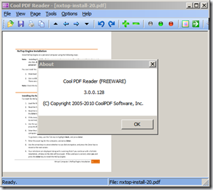

As written in my previous post, I have just finished installing a Server 2008 R2 to conduct a proof of concept. I have also some PDF documents that I will use for reference. So I was just about to install some PDF reader software, but then I thought, hey why “install” software, there must be something small out there that allows me reading a PDF file without having to install anything on my fresh installed server. 

  I’ve come across various portable applications, but at the end I found a really **cool **one called Cool PDF Reader, well *neat* would actually be the better word, as the executable only uses **651KB** and does not require an install. 

   

  Cool PDF Reader is FREE and can be downloaded from [here](http://www.pdf2exe.com/reader.html).

