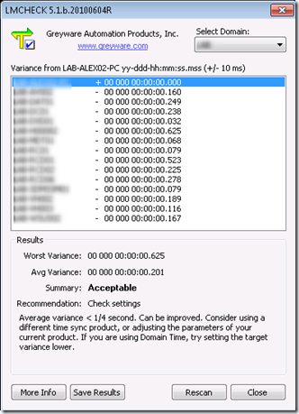

Refreshing my knowledge a bit on Time Synchronization, NTP etc. and came across this utility. It’s FREE and doesn’t require installation.

  The Domain Time LMCheck test tool lets you assess the current time of all the Windows machines on your network quickly and easily. It uses the built-in LAN Manager NetRemote TOD (Time of Day) function to check the time on all the machines in the browse list.

   LMCheck can be downloaded from [here](http://www.greyware.com/software/domaintime/instructions/tools/lmcheck.asp)

