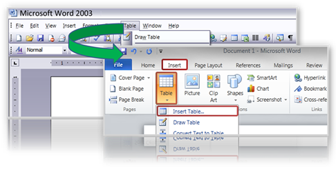

Having difficulties finding menu and toolbar commands in Office 2010? Here’s a nice tool called the Interactive menu to ribbon guide. You can either download the offline versions [here](http://www.microsoft.com/downloads/en/results.aspx?freetext=2010%20Interactive%20menu%20to%20ribbon%20guide&displaylang=en&stype=s%5Fbasic) or access the guide directly from the web [here](http://office.microsoft.com/en-us/outlook-help/learn-where-menu-and-toolbar-commands-are-in-office-2010-and-related-products-HA101794130.aspx#_Toc268688374). 

  

