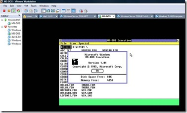

There’s a lot of talk about Windows 95 in these days as it’s 15 years ago when Windows 95 was launched. Well if all are so much in “Operating System Birthday” celebration mode, then let’s not forget that soon it will be 25 years ago since Microsoft released the very first version of [Windows 1.0](http://en.wikipedia.org/wiki/Windows_1.0). 

  More Windows Desktop OS History can be found [here](http://www.microsoft.com/windows/winhistorydesktop.mspx). What happened in 1985 [here](http://channel9.msdn.com/shows/History/The-History-of-Microsoft-1985/) and in 1995 [here](http://channel9.msdn.com/shows/History/The-History-of-Microsoft-1995/). 

  And believe it or not, Windows 1.0 still runs :-)

  

