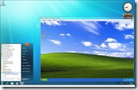

Last week I had a Windows 7 planning meeting with one of our clients and like in any other Windows 7 related meeting that i have had in the past months with other customers, the topic about XP Mode was brought up. It appears that when speaking about application compatibility, first thing people think of is XP Mode. To be honest I don’t blame them, because when XP Mode was first introduced in April 2009 during the Windows 7 Beta phase it was promoted as a possible workaround for Application Compatibility issues and therefore got a lot of attention. The message almost sounded like “*There is no barrier to move to Windows 7 because if you run into an application compatibility issue, you can always use XP Mode*”. So what’s your point? Well, while the statement as such is absolutely true, there are a few things to consider when we speak about computers that run in an enterprise environment.

**What is XP Mode?**
*Windows Virtual PC is the latest Microsoft virtualization technology for Windows 7. It is the runtime engine for Windows XP Mode to provide a virtual Windows environment for Windows 7. With Windows Virtual PC, Windows XP Mode applications can be seen and accessed from a Windows 7 desktop. *
*So in simple words, with XP Mode one can run the Windows XP operating system in a virtualized environment on top of Windows 7

*

 

**System Requirements**

The first version of XP mode required that the hardware supported hardware assisted virtualization (HAV), but that requirement was removed in March 2010 allowing more users to use Windows XP Mode. The hardware therefore should at least meet the [Windows 7 system requirements](http://windows.microsoft.com/systemrequirements) plus an additional 512 MB – 1 GB of memory and 5-15 GB disk space for the Virtual OS.

**Installation – Deployment**

If only needed on a handful of clients Windows XP mode can be installed manually by a systems administrator through the following website [http://www.microsoft.com/windows/virtual-pc/download.aspx](http://www.microsoft.com/windows/virtual-pc/download.aspx) which will install Windows Virtual PC and then the XP Mode Virtual Machine. But if more than just a few installations are needed, companies should consider preparing an automated process for which Microsoft has provided a guide and sample scripts that can be downloaded from [here](http://www.microsoft.com/download/en/details.aspx?displaylang=en&id=21529). When deploying XP mode either the standard Windows XP Service Pack 3 image provided by Microsoft or a customized Windows XP Service Pack 3 image can be used.

**Applications that run in XP Mode**

Applications that need to run in XP Mode can be made available either by having them pre-installed within a customized image or by installing them through Software Distribution. Of course it would also be possible to install applications manually on a per VM basis, but this is a time consuming task. When using Software Distribution, companies must take into account that also the virtual OS will consume a license.

**Antivirus and Security Updates**

Because the virtual OS has also access to a companies IT infrastructure (users will want to print and access data from their applications running in XP Mode), Antivirus protection and security updates must be taken into account as well. Companies will have to carefully look at the licensing aspects because usually most products are licensed on a per installed operating system basis. However some vendors offer special agreements for the use of XP Mode. McAfee allows the use of VirusScan Enterprise on both Windows 7 and XP Mode on one computer and counts this as one license, however for the use of the McAfee Host Intrusion Protection software a single license can only be used either for Windows 7 or Windows XP Mode. If both clients need HIPS, two licenses are needed. (McAfee [source](https://mysupport.mcafee.com/Eservice/Article.aspx?id=KB68366)).

To keep the Windows XP VM up to date with operating system security patches, companies should consider to either patch these clients through their Software Distribution Patch Management infrastructure or configure these clients to directly access Windows update or an internal WSUS server and automatically install patches as they become available respectively become approved by the system administrator. Again the number of deployed clients with XP Mode enabled will dictate the best dictate the best and most efficient strategy.

**Will this work out?**

If the use of XP Mode is only considered for a small number of clients, the effort of manually installing XP mode or preparing an automated deployment process is acceptable, however if a company plans to deploy XP Mode on several hundreds of clients and in addition plans to use it for a longer period of time they should look at more scalable solutions such as Microsoft Enterprise Desktop Virtualization (MED-V). MED-V provides a more centralized approach for deploying and managing virtual images. However only companies that have access to MDOP which is available through the Software Assurance program can use MED-V.

Running a virtualized Windows XP on top of Windows 7 is probably the easiest way to solve compatibility issues, however companies should not consider the use of XP Mode as a way to get around the effort of testing and remediating their applications for the use with Windows 7. XP Mode should be seen as a short term temporary solution removing potential road blocks for the deployment of Windows 7. In the long run remote desktop virtualization or application virtualization might be a better option.

