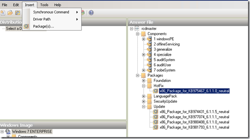

When manually downloading a Microsoft Security Update or hotfix for Windows 7 (Vista) you typically get a file with an MSU file extension. A file with an MSU extension is a Microsoft Update Standalone package. 

  Microsoft Update Standalone Packages are installed through the Windows Update Standalone Installer WUSA.EXE which is located in the  C:\Windows\system32 folder. If you need to install many updates you could create a script like the one below. 

  SET HOTFIXSRC=<folder that contains hotfixes>     
CD /D %HOTFIXSRC%      
FORFILES /P %HOTFIXSRC% /M *.MSU /C "cmd /c wusa @file /quiet /norestart"    

  But if you are using the System Image Manager and want to include security updates or hotfixes in your unattended Windows 7 installation, you can only select CAB files. 

  So where are the CAB files? They are included within the MSU file, so all we need to do is extract them. During the Windows Vista timeframe the recommendation was to use the expand.exe utility.

  expand -f:* "C:\934307\Windows6.0-KB934307-x86.msu" %TEMP%

  In Windows 7 WUSA.EXE has an additional new command line option called **“/extract**”. 

  wusa <updatepackage.msu> /extract:c:\temp\cab

  To automate the process of extracting the CAB files from several MSU files, I have modified a [script](http://www.myitforum.com/articles/20/view.asp?id=10032) that Jason Scheffelmaer shared back in 2007 on [MyITForum](http://www.myitforum.com/absolutenm/). 

  Dim ExtractFolder: ExtractFolder = "**Cabs**" 

  Dim fso: Set fso = CreateObject("Scripting.FileSystemObject")     
Dim wshShell: Set wshShell = CreateObject("Wscript.Shell") 

  Dim scriptDir     
scriptDir = fso.GetParentFolderName(WScript.ScriptFullName) 

  On Error Resume Next     
' Deleting ExtractFolder subfolder to start clean      
fso.DeleteFolder ScriptDir & "\" & ExtractFolder      
Err.Clear      
On Error Goto 0 

  ' Create Cabs folder, we will put the extracted cabs there.     
fso.CreateFolder ScriptDir & "\" & ExtractFolder 

  Dim scriptFolder     
Set scriptFolder = fso.GetFolder(ScriptDir) 

  dim scriptFolderFiles     
Set scriptFolderFiles =scriptFolder.Files 

  Dim file, TotalExtracted 

  ' Initialize     
TotalExtracted = 0 

  ' Loop thru all files in the folder that the script is ran in     
For Each file in scriptFolderFiles      
If Right(file.name, 4) = ".msu" Then      
'wscript.echo "Processing " & file.name      
iRetVal = WshShell.Run("**wusa.exe** " & ScriptDir & "\" & file.Name & "** /extract:**" & ScriptDir & "\" & ExtractFolder, 0, True) 

  If iRetVal = 0 Then     
TotalExtracted = TotalExtracted + 1      
Else      
Wscript.echo "An error occurred while trying to extract the cab file from " & file.name & "..."      
End If      
End If      
Next 

  ' Delete any unneeded wsusscan.cab files from the extractFolder     
On Error Resume Next      
fso.DeleteFile ScriptDir & "\" & ExtractFolder & "\wsusscan.cab", True      
On Error Goto 0 

  WScript.Echo "A total of " & totalExtracted & " cab files were extracted. Script Complete."

