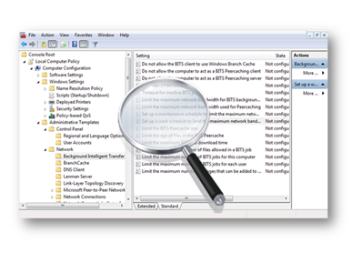
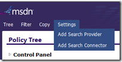
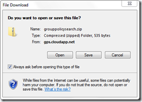
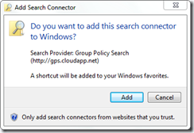
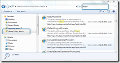

Since the release of Windows 7 and Server 2008-R2 we have about 3000 Group Policy Settings available to centrally configure and manage Windows clients and servers. Though some among us might have worked with GPO settings from the early days on, knowing about the existence of each and every available setting is nearly impossible. It still happens to me that while I am configuring a specific GPO setting, I do come across other GPOs I didn’t knew of yet. 

  

  Have we not all been in a situation once, where we wondered whether a certain system configuration item could be managed via a GPO setting? So what would you do? Open the Group Policy Management Console and browse through the settings until you find the setting you’ve been looking for? Yes, that is possible approach and sometimes the quickest if you know in which area the setting is most likely stored. Another approach is to download the [Group Policy Settings Reference for Windows and Windows Server](http://www.microsoft.com/downloads/details.aspx?FamilyID=18c90c80-8b0a-4906-a4f5-ff24cc2030fb&displaylang=en) spreadsheet and search through the Excel sheet. 

  Now here’s another nice solution that allows you to search for Group Policy settings without opening the GPMC or an Excel sheet. All you need is Windows 7 and Internet Access. 

  Open Internet Explorer and go to [http://gps.cloudapp.net/](http://gps.cloudapp.net/) (Group Policy Search) 

  In the Settings Menu select “**Add Search Connector**”.

   

  Download the Search Connector configuration file.

  

  Select “**Add**” to install the Search Connector.  

   

  Select Group Policy Search and type a word within the search bar. 

   

  Happy GPO Setting searching!

