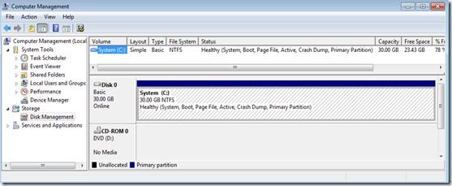
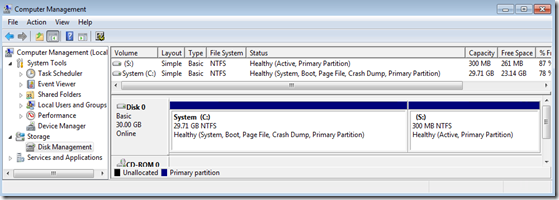

For the use of Bitlocker two partitions are required, this because pre-startup authentication and system integrity verification must occur on a separate partition from the encrypted operating system drive. Now let’s assume you started deploying Windows 7 with just a single partition, but a few months later your company decides to use Bitlocker Disk Encryption. Now you need that second partition!

Not t0o many years ago, when speaking about repartitioning disks most of us would immediately think of some smart 3rd party tools like Partition Magic, but nowadays that’s not necessary anymore Windows 7 provides that functionality natively. For more details on how to Shrink an existing partition read my other post [Shrinking your System Drive](https://www.verboon.info/index.php/2010/01/shrinking-your-system-drive/).

So let’s assume your current systems have just one partition.

 For the use of Bitlocker a second partition is required and the BCD store must be moved into that new partition.

It’s simple ! Microsoft included a handy command line tool called **BdeHdCfg.exe** that allows you to create the Bitlocker partition and move the BCD store. The following command shrinks the system partition, creates the new second 300 MB partition, assigns the drive letter S to it and moves the BCD store.

BcdHdCfg.exe –target C: shrink –newdriveletter S: –size 300 –quiet

Once the process is completed the system must be rebooted. The system now has the 2nd partition.

