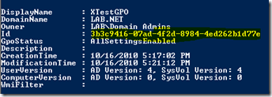
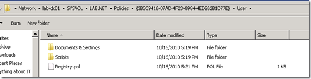
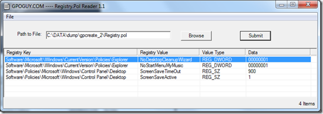
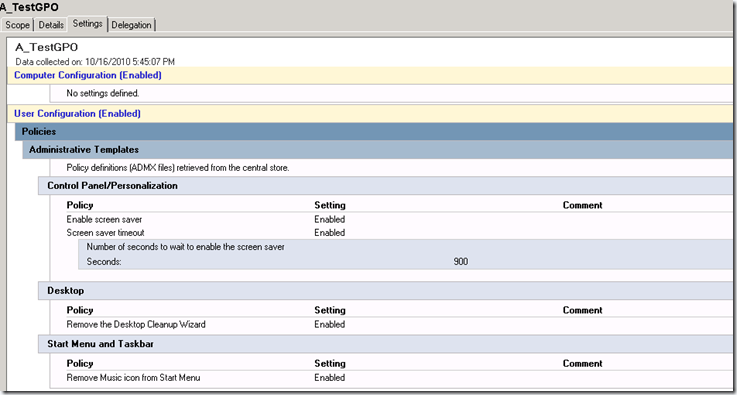

In my previous post I wrote about how to [create Group Policy reports](https://www.verboon.info/index.php/2010/10/creating-group-policy-reports-with-powershell/) using the Group Policy PowerShell CmdLets. Today I want to share with you my first hands-on experiences with creating a Group Policy using PowerShell.

But first, why would one use PowerShell to create Group Policies? Well here are a few use cases:

	
- You are a Consultant and always start your Group Policy Implementation with a set of GPOs including your best practice settings.
	
- You are an Enterprise Administrator and need to create the same Group Policy in multiple domains
	
- You are an Enterprise Administrator and need to create similar Group Policy Objects with just different policy values (Example: a GPO that specifies the WSUS server a client must connect to).

If you aren’t loading the grouppolicy module by default already, you must first import it before you can use the CmdLets. To import the Group Policy module simply type

import-module –Name grouppolicy

at the PowerShell command prompt.

To create a GPO object and configure the settings you need the following CmdLets:

New-GPO

Set-GPRegistryValue

To familiarize yourself with these commands, I recommend to have a look at the CmdLet help description. Just type get-help set-gpregistryvalue or get-help New-GPO at the PowerShell command prompt and you get a detailed syntax description of the CmdLets.

Creating a new GPO is pretty straightforward the challenge is more with the settings, here you need to use the Set-GPRegistryValue command and provide all the Registry values. To find the registry keys for a given Group Policy settings you can of course use the online Group Policy Search (I wrote about that one [here](https://www.verboon.info/index.php/2010/04/tooltip-group-policy-search/) and [here](https://www.verboon.info/index.php/2010/09/finding-group-policy-settings-through-windows-7-search-connector/)) but we also need the Registry Value Type information (String, Dword etc., so I took a kind of a different approach.

First I created a Group Policy called **XTestGPO** manually within the Group Policy Management Console. As most of you know, all registry settings are stored within the file **registry. pol** that is stored within the user and/or machine folder of the Group Policy object folder. So once I finished creating the GPO, I ran the following command to get the GPOs GUID.

Get-GPO –Name “XTestGPO”

which gave the following result:

[

](https://www.verboon.info/wp-content/uploads/2010/10/image18.png)

Now that I had the GUID, I could easily find the Group Policies object folder on the domain controller to get the registry.pol file.

[

](https://www.verboon.info/wp-content/uploads/2010/10/image19.png)

To see the content of the registry.pol file I used the [RegistryPol Reader](http://www.gpoguy.com/FreeTools/FreeToolsLibrary/tabid/67/agentType/View/PropertyID/87/Default.aspx) utility from [gpoguy.com](http://www.gpoguy.com/)

[

](https://www.verboon.info/wp-content/uploads/2010/10/image20.png)

So now that I had the Registry key, value, type and data information I could actually start creating my Group Policy creation PowerShell Script that looks as following:

```
import-module -Name grouppolicy

Write-Host "Creating Group Policy Object with name A_TestGPO"
New-GPO -Name A_TestGPO

Write-Host "Setting Screen saver timeout to 15 minutes"
Set-GPRegistryValue -Name "A_TestGPO" -key "HKCU\Software\Policies\Microsoft\Windows\Control Panel\Desktop" -ValueName ScreenSaveTimeOut -Type String -value 900

Write-Host "Enable Screen Saver"
Set-GPRegistryValue -Name "A_TestGPO" -key "HKCU\Software\Policies\Microsoft\Windows\Control Panel\Desktop" -ValueName ScreenSaveActive -Type String -value 1

Write-Host "Disable Desktop Cleanup Wizzard"
Set-GPRegistryValue -Name "A_TestGPO" -key "HKCU\Software\Microsoft\Windows\CurrentVersion\Policies\Explorer" -ValueName NoDesktopCleanupWizard -Type Dword -value 1

Write-Host "Remove MyMusic from Start Menu"
Set-GPRegistryValue -Name "A_TestGPO" -key "HKCU\Software\Microsoft\Windows\CurrentVersion\Policies\Explorer" -ValueName NoStartMenuMymusic -Type Dword -value 1
```

Side note: Microsoft has used the ScreenSaveTimeOut setting in their CmdLet example which has a typo, the example shows *Dword* but it must be *String*.

Here’s the new GPO called A_TestGPO created through PowerShell.

[

](https://www.verboon.info/wp-content/uploads/2010/10/2010-10-16-18h50_17.png)

