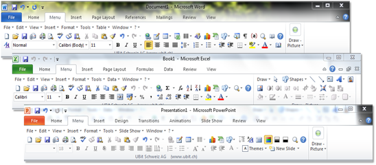

For those that do still struggle with the Office Ribbon here’s a nice add-on from [Ubit Software](http://www.ubit.ch/software/ubitmenu-languages/) that brings back the classic menu for Office 2007 and Office 2010. 

  UbitMenu for Office 2007 and 2010 is free for *private* use. Download UbitMenu from [here](http://www.ubit.ch/software/ubitmenu-languages/)

  

