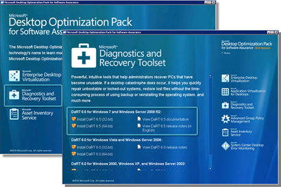
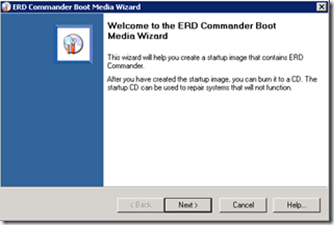
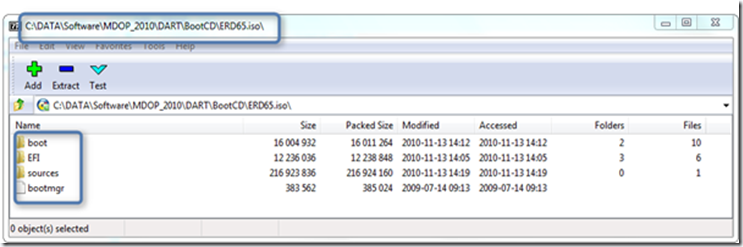
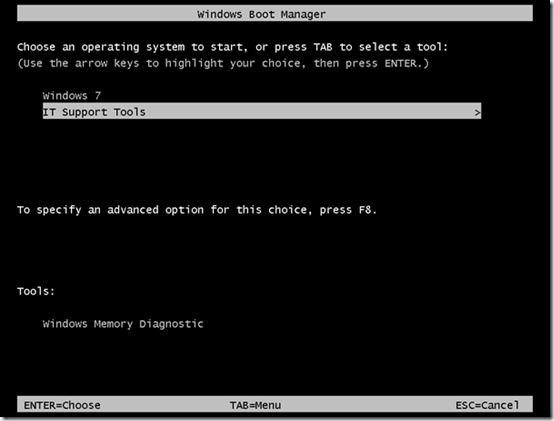
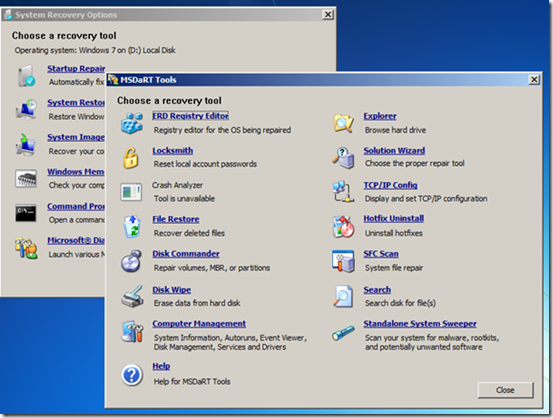

Last weekend I went through the Microsoft TechEd 2010 presentations and one of the presentations that got my attention was “Keeping Windows Running Effeciently with the Microsoft Diagnostics and Recovery Toolset”. Presentation video and slides from this session can be found [here](http://www.msteched.com/2010/NorthAmerica/WCL309) (TechEd USA) or [here](http://www.msteched.com/2010/Europe/WCL318) (TechEd Europe)

The Microsoft Diagnostics and Recovery Toolset is part of the MDOP Toolset. If you’re not familiar I recommend watching the TechEd presentation or read more [here](http://www.microsoft.com/windows/enterprise/products/mdop/dart.aspx). One interesting concept they speak about is to deploy DART to the client so that it can be started through the Windows 7 Boot menu. DART is a superset of the Windows Recovery Environment which is installed by default with Windows 7. Today I am going to show you how you can install DART on your local system and add an additional boot menu option. In a later post I plan to explain how to actually replace the Windows 7 default Recovery Environment with DART.

To set this up I have used a VMWare virtual machine, very useful especially when you need to do a roll back because you messed up the BCD (it happened to me a few times).

First we install the Microsoft Diagnostics and Recovery Toolset that is stored on the MDOP DVD on a Windows 7 client.

Just follow the instructions to complete the installation. Once installed launch the ERD Commander Boot Media Wizard.

Again follow the instructions, it’s quite self explaining otherwise read the provided documentation. When completed, you should get a “ERD65.ISO” file that you could burn to a DVD or connect in VMWare / Virtual PC to boot DART. But to boot DART form our local disk we must extract the content from that ISO file. I used [7-Zip](http://www.7-zip.org/), but you can use any tool that allows you to extract data from an ISO file.

Copy the entire content from the ISO file to a folder called “**C:\DART**”. In a real world scenario you want to consider to put this somewhere else, but for demonstration purposes this should work. As a last step we must update the BCD so that we get an additional boot menu option. I assume you are familiar with the BCD Store, if not be careful because wrong BCD Store edits can prevent you from booting your system. (this is why I used a virtual machine).

Copy paste the following code to a batch file called BCD_ADD_DART.CMD and run the script with Administrative rights.

[sourcecode language="plain"]bcdedit /create {ramdiskoptions} /d "IT Support Tools"
bcdedit /set {ramdiskoptions} ramdisksdidevice partition=c:
bcdedit /set {ramdiskoptions} ramdisksdipath \Dart\boot\boot.sdi

for /f "Tokens=3 delims== " %%i in ('Bcdedit -create  /d "IT Support Tools" /application OSLOADER') do SET GUID=%%i

bcdedit /set %GUID% device ramdisk=[c:]\Dart\sources\boot.wim,{ramdiskoptions}
bcdedit /set %GUID% path \windows\system32\winload.exe
bcdedit /set %GUID% osdevice ramdisk=[c:]\Dart\sources\boot.wim,{ramdiskoptions}
bcdedit /set %GUID% systemroot \windows
bcdedit /set %GUID% winpe yes
bcdedit /set %GUID% detecthal yes
bcdedit /displayorder %GUID% /addlast
bcdedit /timeout 5

[/sourcecode]

When completed type BCDEDIT within a command console, you should then see the following entry.

Windows Boot Loader
-------------------
identifier              {68484f94-d7b7-11de-b4dc-89a033fa5132}
device                  ramdisk=[C:]\Dart\sources\boot.wim,{ramdiskoptions}
path                    \windows\system32\winload.exe
description             IT Support Tools
osdevice                ramdisk=[C:]\Dart\sources\boot.wim,{ramdiskoptions}
systemroot              \windows
detecthal               Yes
winpe                   Yes

If that worked, restart your system. You should now see the additional Boot Menu option called “IT Support Tools”

During the startup of DART you will get a few prompts, finally you should see the following menu.

That’s it.

