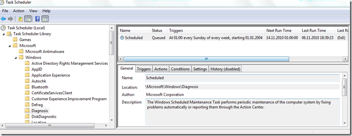
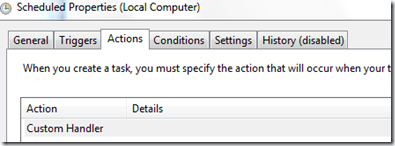
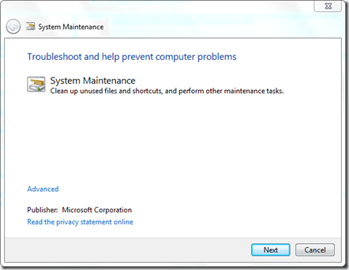
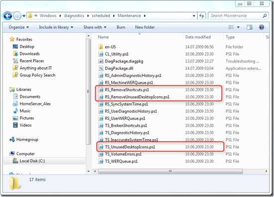
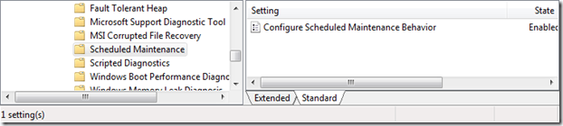
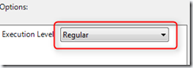
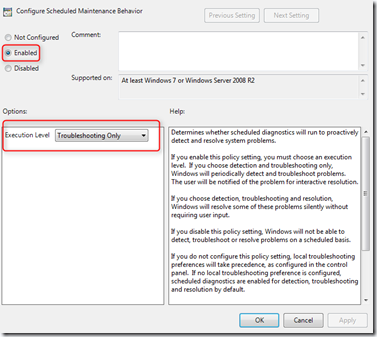
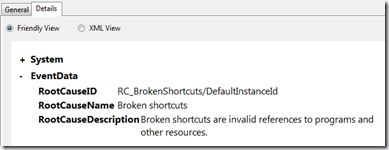
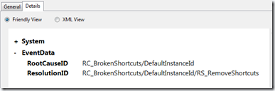

This week one of my customers send me the Microsoft support article [KB978980 – Desktop Shortcuts disappear in Windows 7](http://support.microsoft.com/kb/978980) and the request to make sure this wouldn’t happen to his clients. In short, if a user creates a shortcut that points to a location that isn’t available at the time when the weekly scheduled system maintenance task is running, the shortcuts are considered as broken and therefore automatically deleted. 

  In the support article Microsoft doesn’t really provide a fix to solve this problem but rather describes 2 workarounds that don’t sound feasible to me. 

  ***Method 1        
**Keep the number of broken shortcuts on your desktop to four or less. *

  ***Method 2       
**If you must have more than four broken shortcuts on your desktop, you can disable the System Maintenance troubleshooter.*

  Well I don’t think we can expect our users to start counting their potentially broken desktop shortcuts and turning off the system maintenance troubleshooter isn’t a good idea too, because the system maintenance task does more than checking for broken shortcuts. Before explaining how this behavior can be changed through Group Policy, let’s first have a look what is really happening here.   

  Open the Task Scheduler (you can run Taskschd.msc to start the Task Scheduler) and open the Microsoft, Windows Library, then select the Diagnosis Task. As you can see, this Task by default runs once a week. 

  

  Now let’s have a look what this Task really does. 

  

  OK, a Custom Handler, that doesn’t tell us that much, but let’s be creative and just type “Maintenance” in the Start Menu Search bar and then we find “Perform recommended maintenance tasks automatically”. So let’s start that one, and hey that is the Troubleshooting Wizard. 

  

  By the way, you can launch the system maintenance directly using the following command line: msdt -id MaintenanceDiagnostic

  Now we know that this belongs to the Troubleshooting stuff that comes with Windows 7, those that have been looking at this earlier know that this is all stored under C:\Windows\Diagnostics and within the Diagnostics folder there is a Scheduled\Maintenance folder

  

  And there we find the scripts being executed during the scheduled system maintenance tasks. Because these are all PowerShell scripts, I first thought about just modifying these scripts so that they wouldn’t delete any of these broken shortcuts, but since these files are system protected that doesn’t sound like a good idea to me, at least not for enterprise clients, because if you then run SFC /SCANNOW, you’ll get errors reported. If you want to apply that script editing hack on your personal computer you find possible approaches [here](http://www.microtom.net/?p=638) and [here](http://thumbpress.com/desktop-icons-disappear-heres-how-to-fix-this-problem-in-windows-7/). 

  Good, now that we know where this all comes from, let’s jump over to the Group Policy management console. Under Computer Configuration \ Administrative Templates \ System \ Troubleshooting and Diagnostics we have a Scheduled Maintenance branch that holds the Group Policy Settings for the Scheduled Maintenance Behavior. 

  

  If we enable this Setting, we can configure the Execution Level to Regular or Troubleshooting only. By the way, the help text talks about detection, troubleshooting and resolution, this corresponds to the “Regular” option. 

  

  If we want to prevent scheduled system maintenance task from automatically deleting broken shortcuts we must configure the** Execution Level** to** Troubleshooting only**. 

  

  To test this behavior, simply create more than 4 shortcuts on your desktop and then delete or copy away the underlying files these shortcuts point to. (Do not “move” the files, because that won’t break the shortcuts). Then run the scheduled task manually and you will notice that the shortcuts won’t be deleted automatically anymore. I also recommend to have a look at the event log under **Application and Service Logs \ Microsoft \ Windows \ Diagnosis-Scheduled** and notice the different logging depending on how you have configured the Group Policy Setting. 

  Logging when set to Troubleshooting only   

  Logging when not configured or set to Regular   

  When the Scheduled System Maintenance is configured to only detect issues, any issues are reported to the Action Center.

