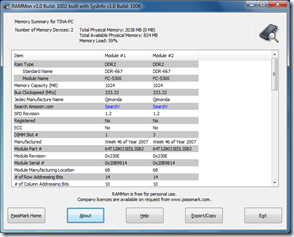

Plan to add more RAM to your PC? What memory module do you need? Here’s a nice FREE (for personal use) tool called RAMMon.

  

  ***RAMMon** is an easy to use Windows based application that allows users to quickly retrieve the Serial Presence Detect (SPD) data from their RAM modules. It will allow users to identify a multitude of attributes, of which, includes the manufacturer, the clockspeed and other data of their DDR2, DDR3, XMP and EPP memory devices and even some older memory types.*

  Download from [here](http://www.passmark.com/products/rammon.htm)

