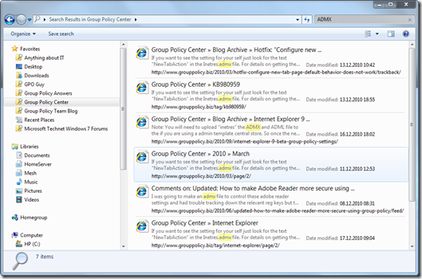

One of my favorite features of Windows 7 is Federated Search allowing users to search remote data sources from within the windows Explorer. I wrote about this feature earlier in [Windows 7 Search Provider](https://www.verboon.info/index.php/2010/04/windows-7-search-provider/) and [Finding Group Policy Settings through Windows 7 Search Connector](https://www.verboon.info/index.php/2010/09/finding-group-policy-settings-through-windows-7-search-connector/). Today I created and found some additional Search Connectors for sites and blogs that I read frequently. You can download the Win7SearchConnect_collection1.zip from [here](https://www.verboon.info/fun/Win7SearchConnect_collection1.zip)

                               The following Windows 7 Search Connectors are included

-              GPO Guy
-              GP Answers
-              Group Policy Center
-              Group Policy Team Blog
-              Microsoft TechNet Windows 7
-              Anything About IT
-              Citrix Knowledge Base

