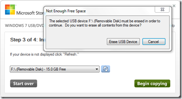
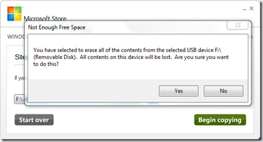
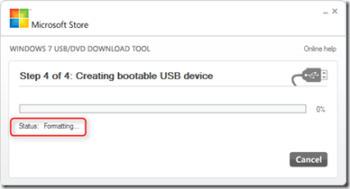
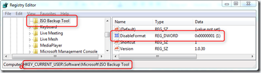
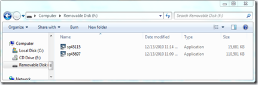
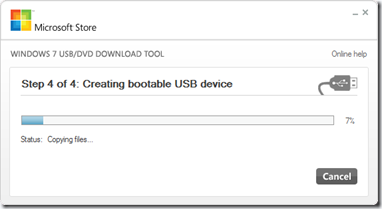
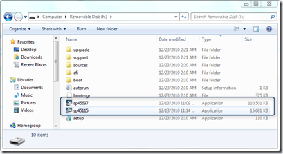
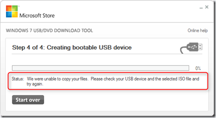

If you want to install Windows 7 from USB you can use Microsoft’s Windows 7 USB/DVD Download Tool which you can download from [here](http://wudt.codeplex.com/). By default the tool requires that the USB disk is being erased before copying the Windows 7 installation media, hence you get the following messages. 

  

  

  

   

  This is a bit laborious, because sometimes you might want to store some additional files on your installation media, instead of having to store it elsewhere. I came across a small comment at the bottom of the Tools website about how to prevent the tool from erasing / formatting the USB drive prior copying the installation media. 

  To bypass the formatting edit the registry as following: 

  1. Ensure the registry key "HKCU\SOFTWARE\Microsoft\ISO Backup Tool" is created.   
2. Create a new DWORD value named "DisableFormat" in this location and set the value to 1.

  

  So let’s give this a try. I have copied the following 2 files on a pre-formatted USB device. 

  

  If now we run the Tool again, guess what…..you get the same messages about erasing data, but ignore these, instead of first formatting the USB drive, it will immediately start copying the content. 

  

  and after a while…..we have a our installation media ready, including our own files. 

  

  By the way, when I first inserted my brand new 15 GB flash drive to prepare the installation media it wouldn’t work and I got the following message. 

  *“We were unable to copy your files. Please check your USB device and the selected ISO file and try again*”. 

  

  I had assumed that it was because of the size of the USB stick, as till now I had not used any USB sticks larger than 8 GB. We’ve gone down several paths such as creating a smaller partition on it and that then worked, but in the end all that I needed to do to make it work was to once completely clear the USB stick using diskpart  creating a new full partition on it and formatting it.

